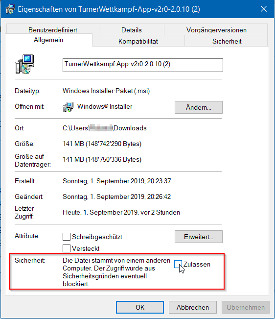

# Installation

Die App lässt sich über Installer-Packages installieren.

Diese lassen sich hier herunterladen:

[http://luechtdiode.github.io/KuTu](http://luechtdiode.github.io/KuTu)

Die Installation erfordert Administrator-Rechte. Danach kann jeder Benutzer die App bedienen.

## Vertrauenswürdigkeit der App
Die Installationsdatei ist nicht signiert und führt deshalb nach einem Download aus dem Internet bei der Installation zu Sicherheitswarnungen - oder die Installation bricht ab. Es gibt für die jeweiligen Betriebssysteme Workarounds, mit denen die Installation ordentlich ausgeführt werden kann.

### Windows 10

Nach dem Download der `msi`-Datei ist es notwendig, die folgende Einstellung im Eigenschaft-Dialog \(rechte Maustaste auf der msi-Datei und dann Eigenschaften\) vorgenommen wird:

### Mac OS

1) Nach dem Download die `pkg`-Datei doppelclicken,
2) danach in den System-Einstellungen unter Sicherheit den Button clicken, dass diese Installation diesmal dennoch gemacht werden darf.
3) Dann wieder zum Installations-Fenster gehen und den Anweisungen folgen.

## Weiterführende Kapitel

* [Systemvoraussetzungen](systemvoraussetzungen.md)
* [Dateiablage](dateiablage.md)
* [Konfiguration](konfiguration.md)
* [Backup / Restore / Import / Export](backup__restore__import__export.md)

