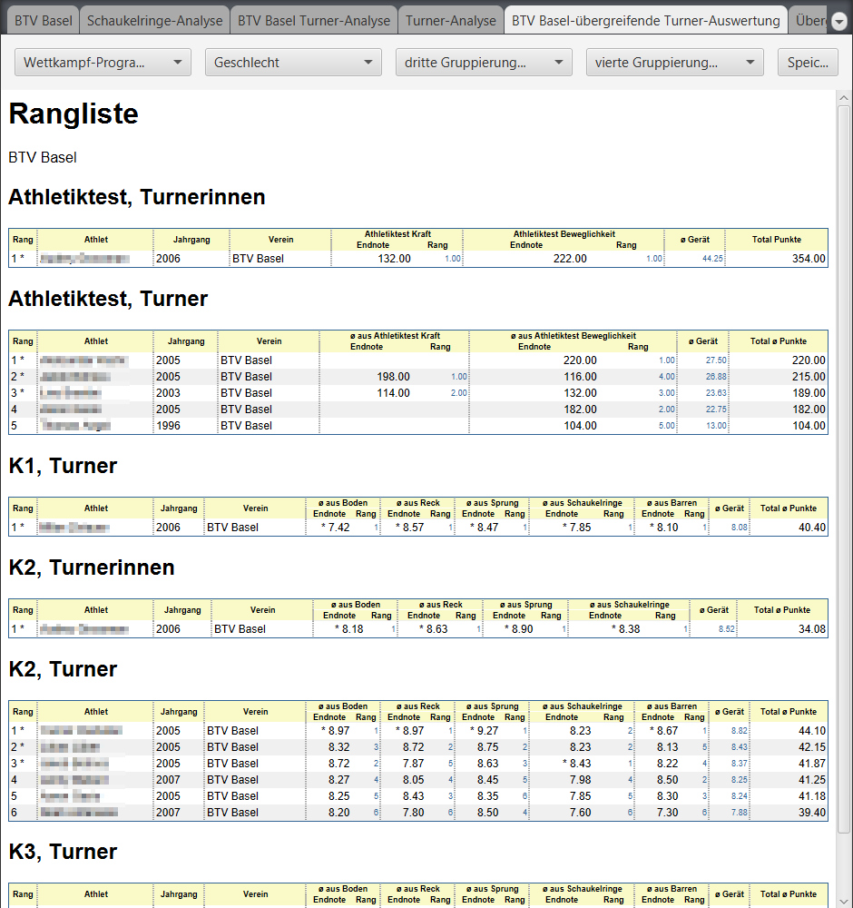
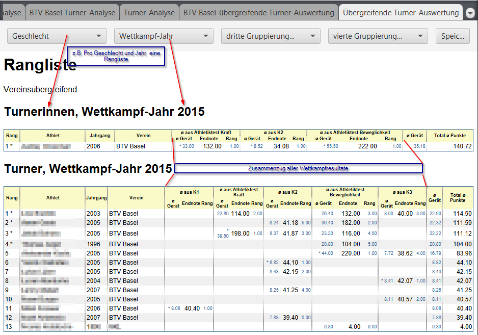
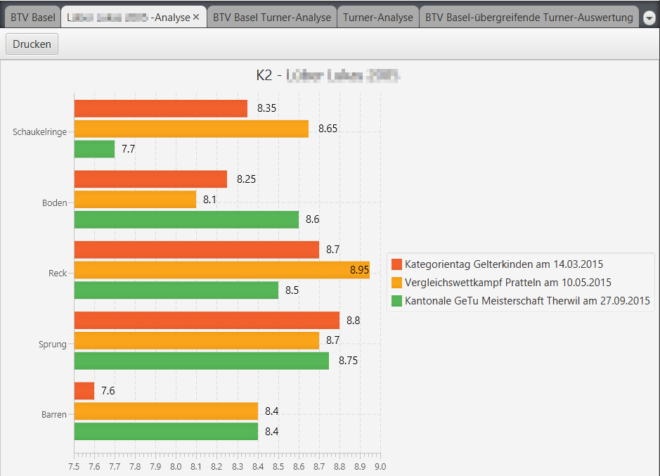
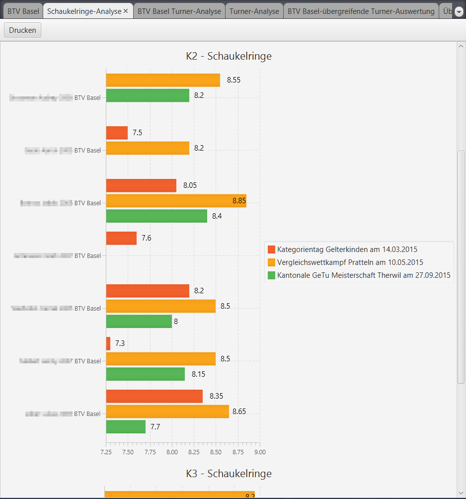

# Resultat-Analysen {#resultat-analysen}

Die Resultate der Turner interessieren meist auch deren Vereine und dessen Trainer. 
Mit dieser App lassen sich Auswertungen pro Turner, pro Verein etc. machen. 
Der Einstieg in diese übergreifenden Auswertungen geschieht über die Vereins-Ansichten 
mit den jeweiligen Turner/Innen Listen:

## Individuelle Auswertung:

## Auswertung auf Turner-Ebene:

## Auswertung auf Geräte-Ebene:

