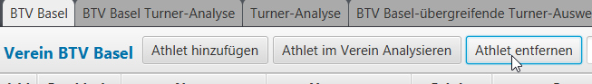
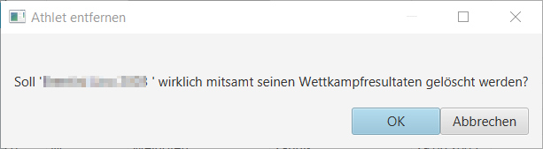

# Turner/-Innen zu einem Verein löschen

Mit einem Click auf den Button "`Athlet entfernen`" ...

wird sowohl der/die in der Liste selektierte Athlet / Athletin als auch dessen Wettkampfresultate gelöscht:

