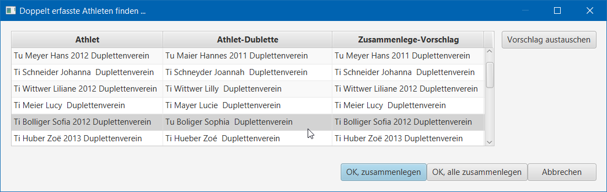

# Doppelt erfasste Turner/-Innen finden und bereinigen

## Doppelt erfasste Turner/-Innen finden und zusammenlegen 

Mit dem Menu-Befehl "`Doppelt erfasste Athleten finden ...`" auf dem Navigations-Knoten `Athleten` werden alle Turner/-Innen in der lokalen Datenbank miteinander verglichen. Mit einer Gleichheitsprüfung werden pontentiell doppelt erfasste Turner/-Innen \(Dubletten\) entdeckt und in einer Liste angezeigt.

### Beschreibung der Vorschlag-Liste

| Spalte | Titel | Beschreibung |
| ---: | :--- | :--- |
| 1 | Athlet | Athlet, welcher am `Ende einer Zusammenlegung übrig bleibt`. |
| 2 | Athlet-Dublette | Athlet, welcher am `Ende einer Zusammenlegung gelöscht` wird. |
| 3 | Zusammenlege-Vorschlag | Vorschlag, wie der übrigbleibende Athlet noch mit Eigenschaften aus dem wegfallenden Athlet `veredelt` wird. |

Die Zuteilung, welcher Athlet am Ende übrig bleiben soll, kann geändert werden, indem die beiden Athleten mittels `Vorschlag austauschen` getauscht werden. Sollten einzelne Werte am Athlet korrigiert werden, ist es jedoch notwendig, den Dialog noch einmal zu schliessen, um manuell vor der Zusammenlegung die Daten des Athleten zu korrigieren.  
 \(_Die Verwendung dieser Funktion speichert noch keine Daten_\)

Mit `OK, zusammenlegen` wird der gerade selektierte Eintrag verarbeitet und der Dialog wird geschlossen.  
 Mit `OK, alle zusammenlegen` werden alle angezeigten Einträge verarbeitet und der Dialog wird geschlossen.

### `ACHTUNG - eine Zusammenlegung kann nicht wieder rückgängig gemacht werden`.

Bei der `Verarbeitung der Zusammenlegung` werden zunächst alle dem wegfallenden Athlet zugewiesenen Wettkampf-Resultate an den übrigbleibenden Athlet zugewiesen. Danach wird der wegfallende Athlet gelöscht und der übrigbleibende Athlet gemäss Vorschlag veredelt.

### Gleichheitsprüfungung- und Veredelungsregeln

| Feld | Bedeutung | Gleichheitsprüfung | Veredelung |
| ---: | :--- | :--- | :--- |
| Jsid: | Jugend- und Sport Identifikation | Nicht relevant | Wert &gt; 0 überschreibt 0 |
| Geschlecht: | `M` = männlich, `W` = weiblich | Nicht relevant | Wird gemäss Vornamensregister korrigiert, sofern eindeutig zuweisbar |
| Name: | Familienname | Normalisierte Vergleiche mit [`Beider Morse`](https://stevemorse.org/phonetics/bmpm.htm), [`Kölner Phonetik`](https://de.wikipedia.org/wiki/Kölner_Phonetik), [`Levenshtein-Distanz`](https://de.wikipedia.org/wiki/Levenshtein-Distanz) und mit einem auf `Europäische Namen` optimierten Codec | Keine Veredelung |
| Vorname: | Vorname | Wie beim Namen. Zusätzlich werden Vornamen als ähnlich betrachtet, wenn sie mit den ersten 3 Buchstaben gleich beginnen | Keine Veredelung |
| GebDat: | Geburtsdatum im Format `TT.MM.JJJJ` | Gleich, wenn der Jahrgang gleich ist | Falls nicht erfasst, wird es vom anderen übernommen. Falls erfasst, aber nur mit Jahrgang \(e.g. `01.01.JJJJ`\), werden Tag und Monat vom anderen übernommen. |
| Strasse, Plz, Ort | Adressfelder | Nicht relevant | Werden übernommen, falls am übrig bleibenden Athlet keine Werte erfasst sind. |
| Activ: | `Activ` = aktiver Turner / aktive Turnerin, `Inaktiv` = ehem. aktiv. Turner/-In. | Nicht relevant | `Activ` gewinnt über `Inaktiv` |
|  |  |  |  |

## Fragen `Q` & `A`ntworten

`Q`: Wie kann ich zwei Athleten zusammenlegen, welche mir nicht in der Liste als Kandidaten aufgelistet werden?  
 `A`: Manuell die beiden Turner im Geschlecht Namen, Vornamen und Geburtsdatum angleichen/korrigieren. Danach die Funktion "`Doppelt erfasste Athleten finden ...`" auf dem Navigations-Knoten `Athleten` erneut anwenden.

`Q`: Was passiert, wenn ich einen Wettkampf importiere, der noch die Athleten in der unbereinigten Form mit sich bringt?  
 `A`: Beim Import der Athleten aus einer `Wettkampf-Export.zip` -Datei werden dieselben Gleichheitsregeln angewendet. Sofern gemäss diesen Regeln erneut der `übrigbleibende Athlet` identifiziert werden kann, wird dieser verwendet.

`Q`: Was passiert, wenn ich Athleten von einem Excel kopiert in einen Wettkampf importiere?  
 `A`: Beim Import der Athleten via `Excel-Zwischenablage` werden dieselben Gleichheitsregeln angewendet. Sofern gemäss diesen Regeln bestehende Athleten identifiziert werden, werden diese als Vorschlag im Import-Dialog angezeigt.

`Q`: Was ist mit Athleten, die in mehreren Vereinen gespeichert sind?  
 `A`: Das ist korrekt. Ein Athlet wird u.a. mit seiner Vereinszugehörigkeit identifiziert, da in den meisten Fällen keine Adressdaten bekannt sind. Aktuell ist es deshalb nicht möglich, alle Resultate eines Athleten aus mehreren Vereinen zu aggregieren.

`Q`: Was bedeutet Dublette?  
 `A`: Siehe Wiki [https://de.wikipedia.org/wiki/Dublette](https://de.wikipedia.org/wiki/Dublette) und [https://de.wiktionary.org/wiki/Dublette](https://de.wiktionary.org/wiki/Dublette)

