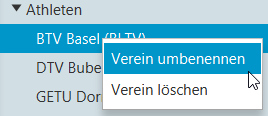

# Verein bearbeiten

Rechte Maustaste auf dem Verein, den man bearbeiten möchte, den Befehl `Verein umbenennen` wählen:

Dann öffnet sich der Dialog, in dem der Vereinsname und der zugehörige Verband bearbeitet werden kann.

Mit OK werden die Änderungen gespeichert.
