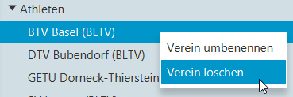
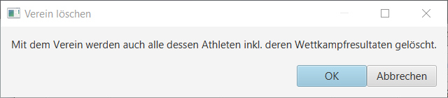

# Verein löschen

Rechte Maustaste auf dem Verein, der gelöscht werden soll:

Wenn dann die Sicherheits-Abfrage bestätigt wird, wird der Verein, alle zugeordneten Turner/-Innen sowie dessen Wettkampfresultate gelöscht:

