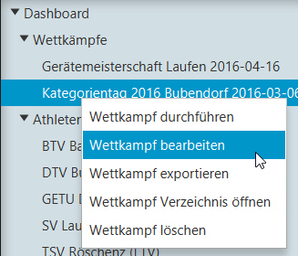
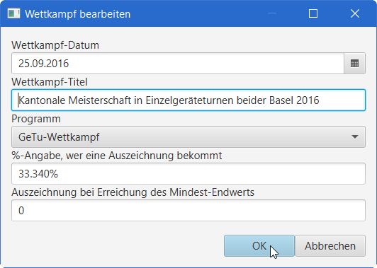

# Wettkampf bearbeiten

Mit rechter Maustaste auf dem Wettkampf, dessen Grund-Daten bearbeitet werden sollen, das PopUp Menu öffnen und dann den Befehl "`Wettkampf bearbeiten`" wählen:

Im anschliessend geöffneten Dialog können dann die Daten bearbeitet werden:

