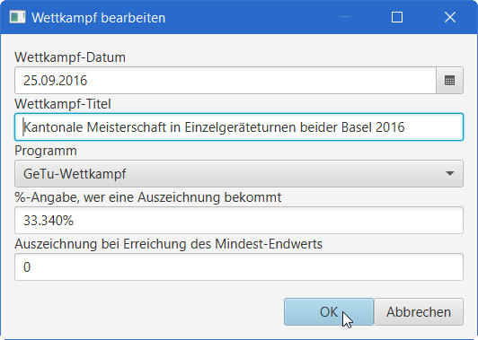

# Wettkampf bearbeiten

In der [Admin-Web-App](../wettkampf-vorbereitung/webadmin.md) wird der Wettkampf über die [Wettkampf-Übersicht](../wettkampf-vorbereitung/wettkampf_uebersicht.md) 
unter `Wettkampf` → `Bearbeiten` geöffnet. Die Bearbeiten-Maske entspricht der Anlegen-Maske und ist bereits mit den aktuellen Werten vorbelegt. Die Verwendung der Felder ist analog wie bei der Neuanlage des Wettkampfes. 
Siehe [Wettkampf anlegen](../wettkampf-vorbereitung/wettkampf_anlegen.md)

In der Desktop-App öffnet man den Dialog mit rechter Maustaste auf dem Wettkampf, dessen Grund-Daten bearbeitet werden 
sollen, und dem Befehl "`Wettkampf bearbeiten`":

Im anschliessend geöffneten Dialog können dann die Daten bearbeitet werden:

