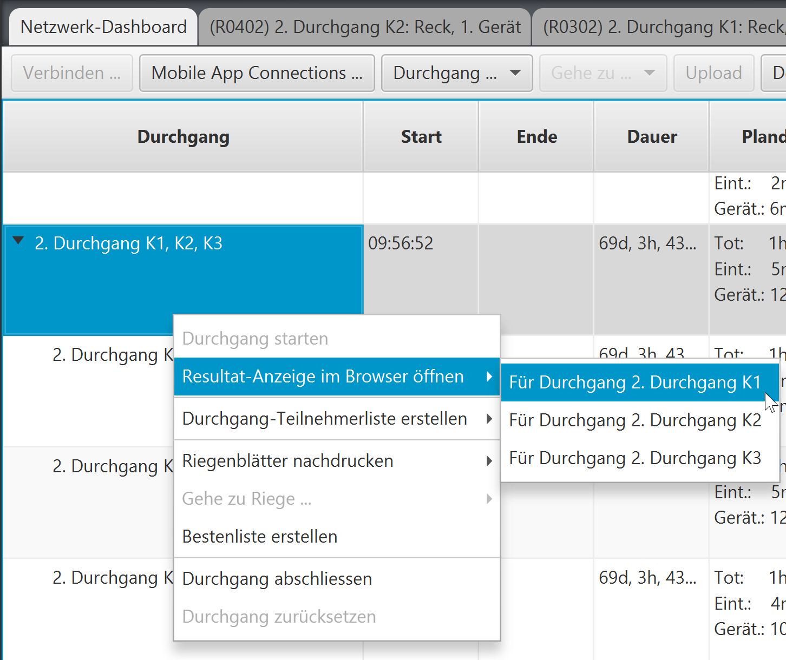
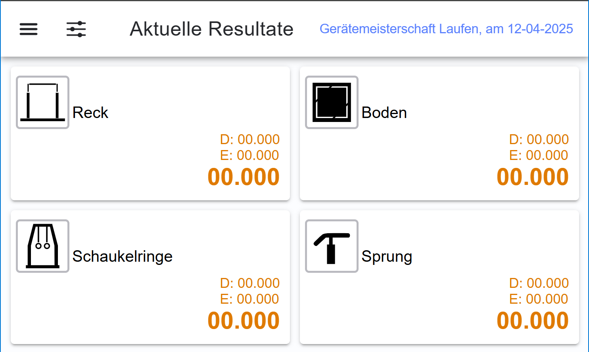
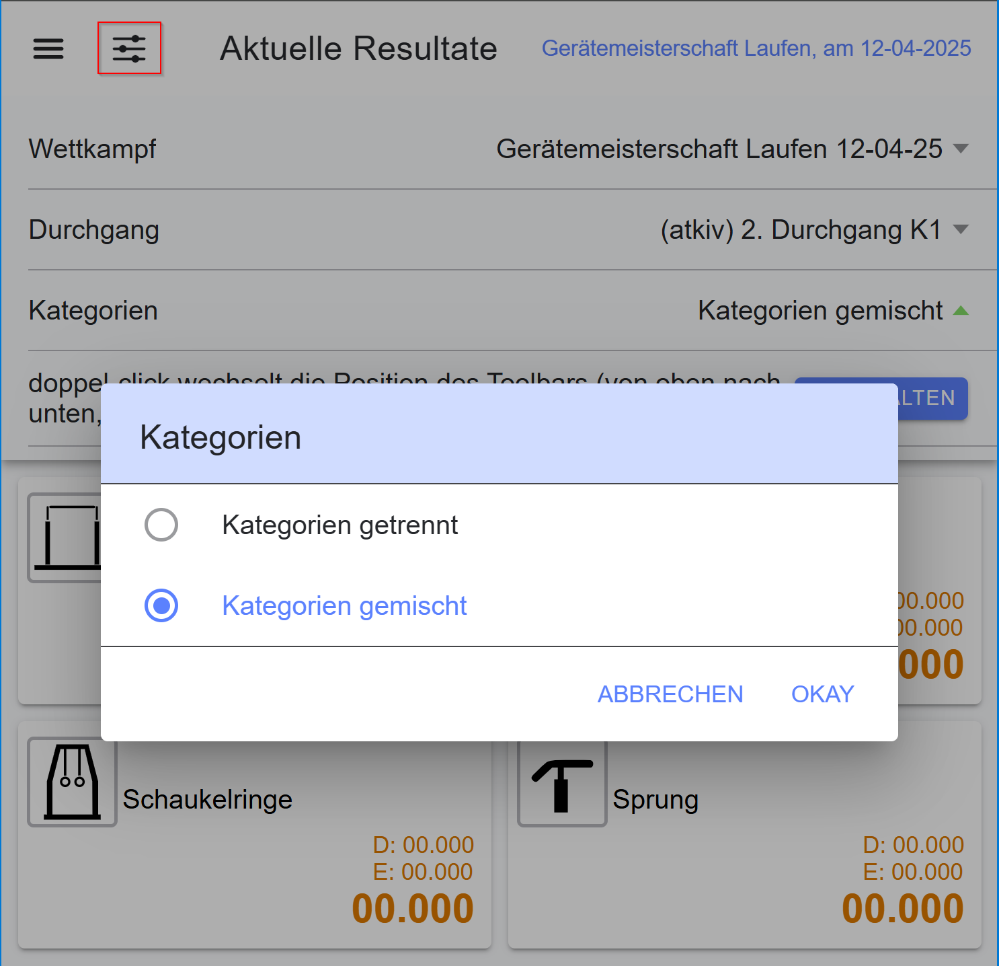
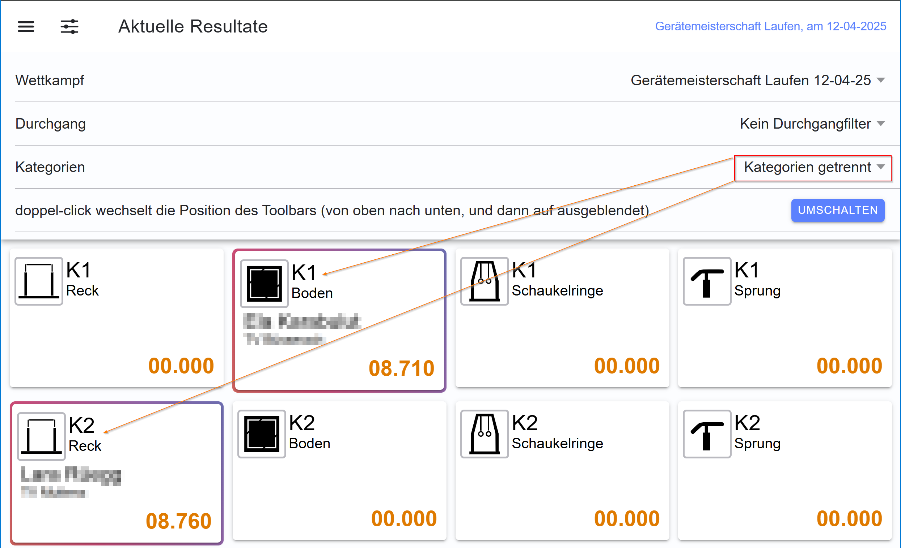
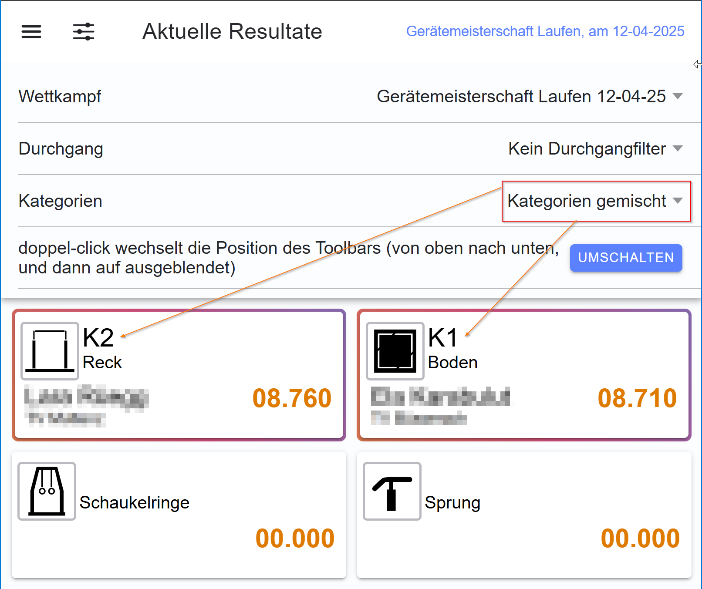
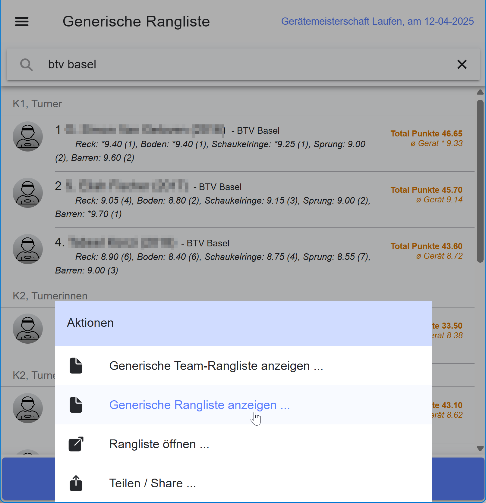

# Letzte Resultate

_Anzeige der Resultate aktuell geturnter Übungen, oder der bereitgestellten Ranglisten_

Während dem Wettkampf werden keine Ranglisten angezeigt. Die Anzeige dient während 24h ab Wettkampfbeginn als reine Live-View für aktuell geturnte Übungen.

Darüber hinaus wird die Ranglisten-Anzeige deaktiviert, sobald ein Durchgang im Wettkampf für
die Resultaterfassung gestartet ist.

## Anzeige der aktuellen Resultate

Bei der Anzeige der aktuellen Resultate werden die Bewertungen pro Gerät angezeigt, welche im Wettkampf geturnt werden.

### Filtermöglichkeiten

* Filterung der Wertungen aus einem bestimmten Durchgang.
* Wenn gerade mehrere Kategorien geturnt werden, kann ein Filter eingestellt werden, der steuert, ob die Geräte pro Kategorie aufgelistet werden, oder in einem gemischten Modus angezeigt werden sollen.

#### Filterung aus einem bestimmten Durchgang

Aus der Wettkampf-App heraus, kann im Network-Tab auf einem Durchgang im Kontext-Menu der Befehl `Resultat-Anzeige im Browser öffnen` gewählt werden. Bei gruppierten Durchgängen können alle Durchgänge der Durchgangsgruppe einzeln gewählt werden.

Daraufhin wird ein Browserfenster geöffnet und die Resultatanzeige mit dem Durchgangsfilter vorbelegt.

Mit dem Schieberegler-Symbol können weitere Optionen eingeblendet werden.

#### Filterung mit mehreren Kategorien

Wenn mehrere Durchgänge mit unterschiedlichen Kategorien parallel aktiv sind, oder wenn in einem Durchgang mehrere Kategorien gemischt geturnt werden, gruppiert die standardmässige Anzeige die
Wertungen pro Kategorie.

Sofern dies zu einem Platz-Problem auf der Anzeige führt, lässt sich die Anzeige auf `Kategorien gemischt` einstellen. Dadurch gibt es nur einen Set aller Geräte unabhängig der geturnten Kategorien.

#### Anzeige-Optionen des Toolbars

Der Toolbar (initial immer oben angeordnet), kann mit einem doppel-click vom oberen Rand zum unteren Rand verschoben werden.
Ein weiterer doppel-click lässt dann den Toolbar ganz verschwinden.

Um den Toolbar wieder sichtbar zu machen, kann ein drittes mal ein doppel-click angewendet werden, oder mittels Browser-Refresh (F5) die Anzeige frisch geladen werden, wobei der Toolbar wieder oben angezeigt wird.

## Anzeige der bereitgestellten Ranglisten

Sobald 24h nach Wettkampf-Beginn verstrichen sind, werden in dieser Anzeige die bereitgestellten Ranglisten angezeigt.
Sofern keine Ranglisten publiziert werden, wird immer eine generische Rangliste aufbereitet. Diese berücksichtigt aber keine wettkampfspezifische Eigenheiten wie z.B. Abgrenzungen auf Verbands-Ebene oder spezielle Filter/Gruppier-Regeln.

In der Rangliste können die Teilnehmer/-Innen gesucht werden. Die eingegebenen Suchwörter werden in den Attributen Name, Vorname, Verein und Kategorie angewendet.