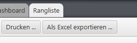
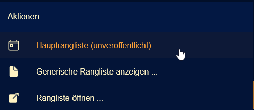
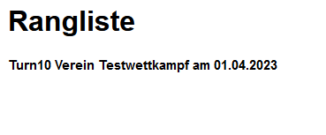

# Ranglisten erstellen

Die Ranglisten werden in der [Admin-Web-App](../wettkampf-vorbereitung/webadmin.md) erstellt und verwaltet. 
In der [Wettkampf-Übersicht](../wettkampf-vorbereitung/wettkampf_uebersicht.md) unter `Verwaltung` → `Ranglisten` öffnet 
sich die Verwaltung der gespeicherten Ranglisten:

Gespeicherte Ranglisten werden mit ihrem Titel, der Abfrage und ihrem Status (`Entwurf` oder `Veröffentlicht`) 
aufgelistet und können geöffnet, bearbeitet, veröffentlicht oder gelöscht werden. Mit `Neue Rangliste` wird eine 
neue Rangliste erstellt resp. eine bestehende bearbeitet:

Die Rangliste wird sofort in der Standard-Einstellung gerechnet und angezeigt.

Wenn Teamregeln für den Wettkampf definiert wurden, und es genügend Teilnehmer gibt, die die Teamregeln erfüllen, kann 
mit der Auswahl des Ranglisten-Typs von Einzelrangliste auf Teamrangliste oder Kombirangliste umgestellt werden.

## Einzelrangliste

In der Einzelrangliste werden die Wertungen pro Turner/-In aufgelistet.

## Teamrangliste

In der Teamrangliste werden Team-Resultate angezeigt. Diese bilden sich aus den Einzelwertungen. Die Teamregeln bestimmen, wann eine Teamzuordnung und Wertung aus der Einzelrangliste für eine Teamwertung herangezogen wird.
Wenn mehrere Teamregeln definiert wurden, kann pro Teamregel eine separate Team-Rangliste erstellt werden.

Siehe auch die detaillierte Beschreibung für die [Definition von Team Zusammenstellungsregeln](../wettkampf-vorbereitung/teamregeln.md)

## Kombirangliste

Bei der Kombirangliste wird pro Einzelrangliste zur selben Gruppierungs- und Filter-Einstellung und pro Teamregel die Teamrangliste angezeigt.

## Filter und Gruppierungsmöglichkeiten

Nun können sowohl `Gruppierungen`  als auch `Filter` konfiguriert werden, um die Abgrenzungen nach den eigenen 
Vorstellungen einzustellen.
Mit den vier möglichen Gruppierungsebenen lassen sich auf vier Stufen jeweils eine Gruppierungsart einstellen.
So lässt sich z.B. eine separate Rangliste pro Verband oder pro Verein oder pro Jahrgang/Altersklasse etc. erstellen.

Mit dem `Filter` lässt sich nach der Gruppierung ein Filter einstellen, dass z.B. mit der Gruppierung "`Geschlecht`" 
im Filter nur noch die Turnerinnen in der Rangliste aufgeführt werden.

Sobald mehr als ein Filter-Eintrag selektiert ist, kann mit dem Schalter `alle` bewirkt werden, dass diese in einer 
Rangliste zusammengefasst werden.
So ist es z.B. möglich, mehrere Kategorien oder Altersklassen in eine Rangliste zusammenzunehmen.

Wenn es z.B. zu wenige Team-Mitglieder in den höheren Leistungsklassen gibt, können diese für die Team-/Mannschaftsrangliste 
zusammengefasst werden.

Mit `Vorschau` wird die Rangliste mit der aktuellen Konfiguration berechnet und angezeigt, bevor sie gespeichert wird.
Mit `Als Entwurf speichern` wird die Rangliste ohne Publikation gespeichert, mit `Speichern & Veröffentlichen` wird 
sie direkt publiziert.

## Rangliste drucken, exportieren

### Drucken

Mit `Öffnen` wird die Rangliste in einem Browser-Fenster geöffnet und kann dort mit jedem aktuellen Web-Browser 
ausgedruckt werden. Die Seitenränder und die Orientierung sind so anzupassen, dass die Ranglisten mit dem Seitenumbruch 
an der richtigen Stelle funktionieren.

### Export der Ranglistendaten in ein Excel-File (Desktop-App)

Die Ranglisten-Daten können in der Desktop-App in ein Excel-File exportiert werden. Diese können nachgelagert für 
individuelle Aufbereitungen verwendet werden (zum Beispiel für das Drucken von Urkunden mit einer Serienfunktion 
basierend auf den exportierten Ranglistendaten aus dem Excelfile).

Pro Rangliste wird ein eigenes Sheet im Excel angelegt.
Die Funktion unterstützt sowohl Einzel- als auch Teamranglisten.
Nach dem Export wird die erstellte Excel-Datei automatisch im Betriebssystem geöffnet.

## Rangliste Einstellungen speichern

Um am Wettkampf selbst keine Überraschungen bei der Ranglistenerstellung zu befürchten, lassen sich die gewünschten 
Einstellungen abspeichern. Gespeicherte Ranglisteneinstellungen werden auch mit der Wettkampf Export-Funktion mit 
exportiert und können so bequem auf den Rechner im Rechnungsbüro übertragen werden.

Die gespeicherten Einstellungen können auch bei anderen Wettkämpfen wiederverwendet werden. Sie lassen sich einfach per 
Copy/Paste aus dem Wettkampf-Folder an den neuen Ziel-Wettkampf kopieren.

In der Admin-Web-App werden die gespeicherten Ranglisten direkt auf der Ranglisten-Seite 
verwaltet (Status `Entwurf` / `Veröffentlicht`). Das Publizieren und Zurückziehen einer Rangliste erfolgt über die 
entsprechenden Buttons auf der Ranglisten-Seite oder direkt im [Wettkampf Drehbuch](drehbuch.md).

## Gespeicherte Rangliste bereitstellen und publizieren

Wenn der Wettkampf im Netz hochgeladen ist, und aktuell eine Verbindung zum Server hergestellt ist, kann eine 
gespeicherte Rangliste auf dem Server bereitgestellt und publiziert werden.

Der Name der Rangliste kann hierüber auch etwas weniger technisch formuliert werden.

Bis zur Publikation ist die Rangliste online sichtbar (als Titel), wird aber noch ohne Inhalt angezeigt. 
Erst wenn die Rangliste publiziert wird (in der Regel nach der Rangverkündigung), wird sie für alle Webapp-Benutzer mit 
Inhalt sichtbar:

 

Eine publizierte Rangliste kann in der Desktop-App nicht mehr zurückgenommen werden. Allerdings lässt sich die Bereitstellung wiederholen, 
mit geänderten Parameter. Dies ist nur sinnvoll, wenn nach der Publikation Fehler in den Filtereinstellungen korrigiert 
werden müssen.
