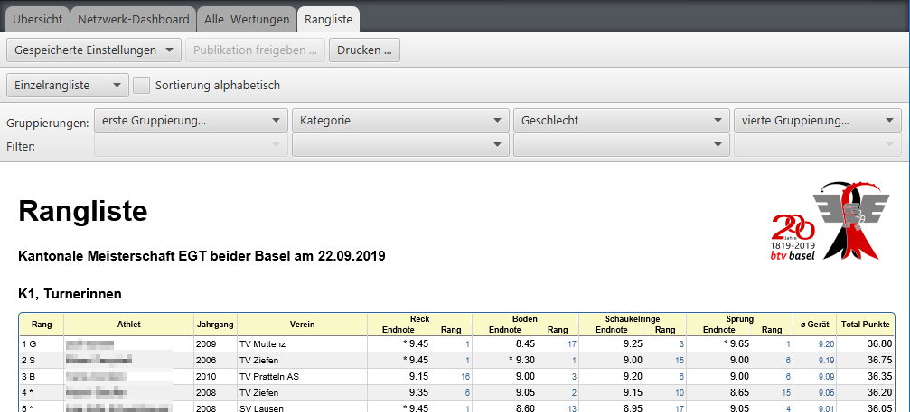
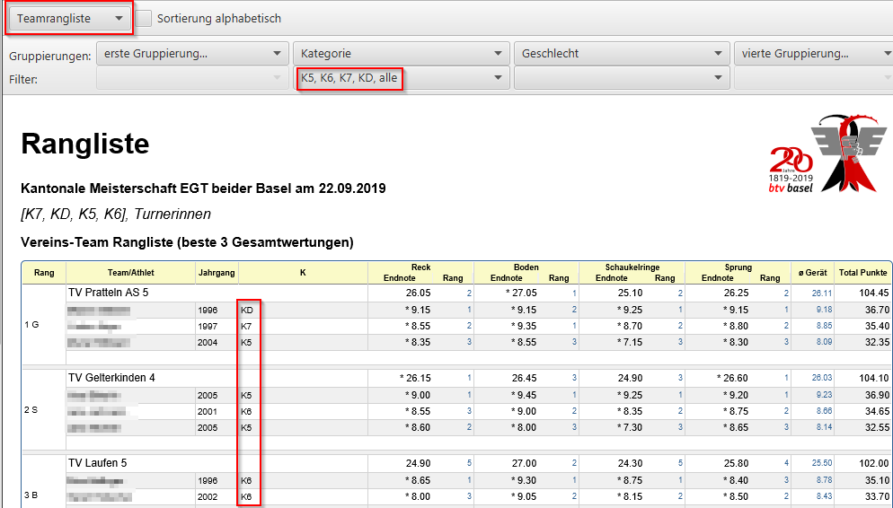
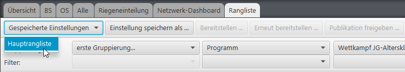
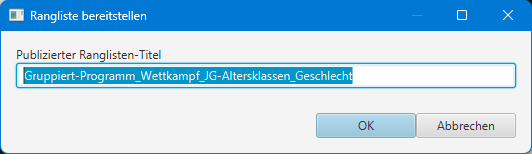

# Ranglisten erstellen

Die Rangliste wird sofort in der Standard-Einstellung gerechnet und angezeigt:

Wenn Teamregeln für den Wettkampf definiert wurden, und es genügend Teilnehmer gibt, die die Teamregeln erfüllen, kann mit der Auswahl des
Ranglisten-Typs von Einzelrangliste auf Teamrangliste oder Kombirangliste umgestellt werden.

## Einzelrangliste

In der Einzelrangliste werden die Wertungen pro Turner/-In aufgelistet.
## Teamrangliste

In der Teamrangliste werden Team-Resultate angezeigt. Diese bilden sich aus den Einzelwertungen. Die Teamregeln bestimmen, wann eine Teamzuordnung und Wertung aus der Einzelrangliste für eine Teamwertung herangezogen wird.
Wenn mehrere Teamregeln definiert wurden, kann pro Teamregel eine separate Team-Rangliste erstellt werden.

Siehe auch die detailierte Beschreibung für die [Definition von Team Zusammenstellungsregeln](../wettkampf-vorbereitung/wettkampf_uebersicht/teamregeln.md)

## Kombirangliste

Bei der Kombirangliste wird pro Einzelrangliste zur selben Gruppierungs- und Filter-Einstellung und pro Teamregel die Teamrangliste angezeigt.

## Filter und Gruppierungsmöglichkeiten

Nun können sowohl `Gruppierungen`  als auch `Filter` konfiguriert werden, um die Abgrenzungen nach den eigenen Vorstellungen einzustellen. 
Mit den vier möglichen Gruppierungskriterien lassen sich auf vier Stufen jeweils eine der folgenden Gruppierungskriterien einstellen.
So lässt sich z.B. eine separate Rangliste pro Verband oder pro Verein oder pro Jahrgang/Altersklasse etc. erstellen.

Mit dem `Filter` lässt sich nach der Gruppierung ein Filter einstellen, dass z.B. mit der Gruppierung "`Geschlecht`" im Filter nur noch die Turnerinnen in der Rangliste aufgeführt werden.

Sobald mehr als ein Filter Eintrag selektiert ist, kann mit dem Eintrag `alle` bewirkt werden, dass diese in einer Rangliste zusammengefasst werden.
So ist es z.B. möglich, mehrere Kategorien oder Altersklassen in eine Rangliste zusammenzunehmen.

Wenn es z.B. zu wenige Team-Mitglieder in den höheren Leistungsklassen gibt, können diese für die Team-/Manschaftsrangliste zusammengefasst werden:

Am Ende, oder nach jeder gewünschter Ranglisten-Einstellung, lässt sich die Rangliste drucken:

1. Je nach Papierformat und ausgewähltem Drucker müssen ev. die Anzahl Zeilen pro Seite justiert werden.
2. Mit aktivierter Checkbox "`via Browser`" wird die Rangliste als HTML-Datei gespeichert und im Webbrowser geöffnet. In dieser Form lässt sie sich gut im Internet integrieren, aber auch mit jedem aktuellen Web-Browser ausdrucken.
3. Mit deaktivierter Checkbox "`via Browser`" kann der gewünschte Drucker ausgewählt werden. Beim Drucken via Web-Browser sind jeweils die Seitenränder und die Orientierung so anzupassen, dass die Ranglisten mit dem Seitenumbruch an der richtigen Stelle funktionieren. Beim direkten Drucken sind keine individuellen Einstellungen möglich.

## Rangliste Einstellungen speichern

Um am Wettkampf selbst keine Überraschungen bei der Ranglistenerstellung zu befürchten, lassen sich die gewünschten Einstellungen abspeichern.

Gespeicherte Ranglisteneinstellungen werden auch mit der Wettkampf Export-Funktion mit exportiert und können so bequem auf den Rechner im Rechnungsbüro übertragen werden.

Die gespeicherten Einstellungen können auch bei anderen Wettkämpfen wiederverwendet werden. Sie lassen sich einfach per Copy/Paste aus dem Wettkampf-Folder an den neuen Ziel-Wettkampf kopieren.

## Gespeicherte Rangliste bereitstellen und publizieren

Wenn der Wettkampf im Netz hochgeladen ist, und aktuell eine Verbindung zum Server hergestellt ist, kann die gespeicherte Ranglisteneinstellung auf dem Server bereitgestellt werden:

Der Name der Rangliste kann hierüber auch etwas weniger technisch formuliert werden:

Nach dem Bereitstellen steht auch die `Publikation freigeben` funktion zur Verfügung:

Bis dahin ist die Rangliste online sichtbar (als Titel), wird aber noch ohne Inhalt angezeigt:

 

Erst wenn die Rangliste publiziert wird (in der Regel nach der Rangverkündigung), wird sie für alle Webapp-Benutzer mit Inhalt sichtbar:

Eine publizierte Rangliste kann nicht mehr zurückgenommen werden. Allerdings lässt sich die Bereitstellung wiederholen, mit geänderten Parameter. Dies ist nur Sinnvoll, wenn nach der Publikation Fehler in den Filtereinstellungen korrigiert werden müssen.
