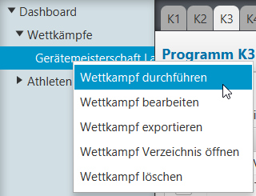
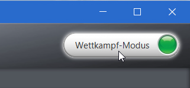
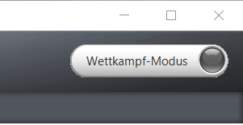

### Wettkampfmodus einschalten {#wettkampfmodus-einschalten}

|||
|-|-|
| Aktivierung über das Pop-Up Menu (mit rechter Maustaste auf dem gewünschten Wettkampf) und dem Befehl &quot;`Wettkampf durchführen`&quot;||
| oder noch einfacher via dem gut sichtbaren `Wettkampf-Modus` Schalter oben rechts im Fenster:||

Dadurch werden alle während der Resultat-Erfassung nicht benötigten Funktionen deaktiviert:

1.  Der linke Navigationsbereich wird minimiert, so dass für die Resultaterfassung mehr Platz zur Verfügung steht.
2.  Die Funktionen zum Hinzufügen, Entfernen, Verschieben in andere Kategorie etc. werden ausgeblendet.
3.  Die Riegen-Spalten werden ausgeblendet.
4.  Die Riegen- und Durchgangs-Einteilfunktionen sind ausgeblendet.