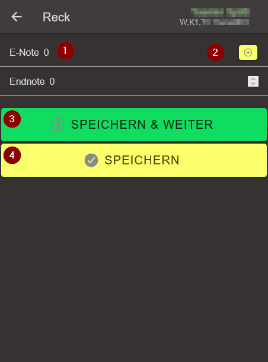

## Instruktion zur mobilen Datenerfassung für Wertungsrichter {#wettkampfnetzwerk-wertungsrichter}

Die Wettkampf-Resultate können anstatt auf Papier auch/alternativ via der Mobile-Browserapp erfasst werden. Auf diese Weise lassen sich die Resultate schneller und sicherer verarbeiten.

Im Falle von Störungen können die Resultate von hand ausgefüllt auf den Riegenblätter in das Rechnungsbüro gemeldet werden.

### Vorbereitungsmassnahmen für jeden Wertungsrichter

#### 1) Es muss ein geeigneter QR-Code Reader auf dem Mobil-Gerät installiert sein. Hierzu eignen sich solche, die den Link direkt im Browser öffnen können - also nicht innerhalb der QR-Code App, wo deswegen meist weniger Display-Fläche zur Verfügung steht.
Der Markt solcher Apps ist sehr lebendig. Wir haben für iOS und für Android folgende Apps getestet, welche diesen Anforderungen genügen:

|Device-OS|QR-Code Reader Empfehlung|
|-|-|
|iOS|Sofern noch ein älteres iOS betrieben wird, ist noch kein QR-Code Reader direkt in der Kamera integriert. In diesen Fällen hat sich `CMYUK QR Reader` [Link auf Apple iTunes](https://itunes.apple.com/de/app/cmyuk-qr-code-reader/id1083426097?mt=8) in unseren Tests geeignet|
|Android|Der `Tahoe QR Code Reader` [Link auf Google Playstore](https://play.google.com/store/apps/details?id=com.gogoideal.qrcode.reader.barcode.scanner.flashlight&hl=de) von Tahoe Digital LTD ist im Android-Gerät als Freeware ohne lästiger Werbung zu empfehlen|

#### 2) Das Mobil-Gerät muss vollständig aufgeladen mitgebracht werden

#### 3) In der Turnhalle muss ausreichend Signalstärke mit dem eigenen Mobilfunk-Anbieter existieren, oder es wird ein Wireless-Netzwerk bereitgestellt, in welches sich der Wertungsrichter einwählen kann und welches Internet-Zugang gewährt.

### In der Turnhalle bei der Wertungsrichter-Instruktion

1. Zugang zum lokalen Wireless einrichten (sofern die eigene Verbindung nicht ausreichend funktioniert)
2. QR-Code für die Berechtigung zur Resultaterfassung scannen. Hierzu wird vom Rechnungsbüro entweder ein QR-Code am Bildschirtm oder auf einem Ausdruck zur Verfügung gestellt: 

### Am Wertungstisch

Auf den Riegenblätter ist ein QR-Code aufgedruckt, mit welchem ein Link bereitgestellt wird, welcher die Mobile-Browserapp direkt an der richtigen Stelle öffnet, so dass dort die Resulate der Riegen-Teilnehmer/-Innen in der entpsrechenden Reihenfolge erfasst werden können.

### Wertungsrichter initialisiert sein Mobile-Device an seiner Station mit dem [QR-Code vom Riegenblatt](#qrcode-printouts)

Auf den Riegenblätter zur manuellen Resultaterfassung, befindet sich jeweils ein QR-Code, mit welchem die Mobile-App direkt am richtigen Ort gestartet werden kann. Zu Beginn kann es sein, dass die Resultaterfassung noch gesperrt ist. Diese wird durch die Wettkampfleitung im Rechnungsbüro freigegeben.

### Wertungsrichter erfasst Wettkampf-Resultate

Mit dem Button `RESULTATE` gelangt man in der Mobile-App zu den Turner/-Innen, die in der Reihenfolge aufgelistet werden, in der sie ihre Wettkampf-Übung vorturnen sollen.

<table><tr><td  valign="top"> 
Mit einem Click auf die Person öffnet sich die Noten-Eingabemaske. 
 
</td><td valign="top" width="280px"> </td></tr>
<tr><td valign="top">

Bei Kunstturn-Wettkämpfen kann hier auch eine D-Note erfasst werden.

Mit einem Click auf die E-Note (1) kann die entsprechende Ausführungs-Note (E wie Execution) erfasst/korrigiert werden.

Die Endnote wird beim `Speichern` oder beim `Speichern & Weiter` (2) vom Programm berechnet und aktualisiert. Bei Athletiktests gibt es verschiedene Multiplikationsfaktoren, die mit der E-Note multipliziert die Endnote ausmachen. Bei Kunstturn-Wettkämpfen wird die D-Note und die E-Note zusammengezählt.

Es können auch Fehler gemeldet werden. Wenn z.B. die Berechtigung für die Resultat-Erfassung abgelaufen ist oder der Durchgang gerade gesperrt ist, können keine Resultate erfasst/korrigiert werden.

<em>Achtung</em> Wenn die eingeblendete Nummer-Eingabetastatur die Buttons überdeckt, muss für dessen Betätigung der Bildschirm nach oben gescrollt werden, so dass die Buttons wieder sichtbar werden.
</td><td width="280px"></td></tr>
</table>

Wenn alle Resultate einer Riege an einem Gerät erfasst sind, soll die Resultaterfassung für diese Riege an diesem Gerät abgeschlossen werden. Dies wird mittels `Eingaben abschliessen` gemacht und bewirkt zusätzlich, dass die nächste Riege für die Resultaterfassung geladen wird.