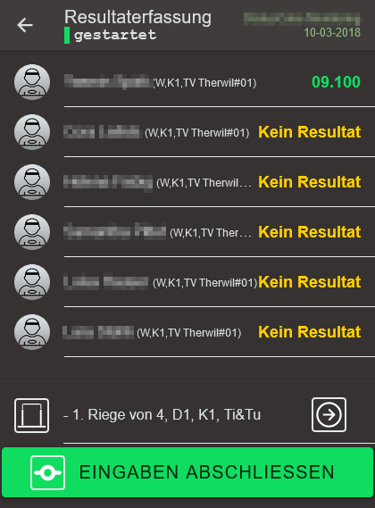

## Wettkampf über das Internet bereitstellen {#wettkampfnetzwerk}

Die Wettkampf-Resultate lassen sich via der Mobile-Browserapp erfassen. Die darüber erfassten Resultate werden zunächst auf einem zentralen Server gespeichert und dann an die übrigen beteiligten Rechner aus dem Rechnungsbüro weiterverteilt.
Auf den Rechner im Rechnungsbüro kann dann die Erfassung gesteuert, kontrolliert und korrigiert werden.

### Schmatische Darstellung:

### Technische Voraussetzungen

* Jeder Teilnehmer muss auf seinem Gerät am Wettkampf-Platz einen Internet-Zugang haben.
* Jeder Teilnehmer, der Resultate erfassen muss (Wertungsrichter) muss auf seinem Mobile-Device einen QR-Code Reader installiert haben. Leider gibt es zahlreiche gratis QR-Code scanner, welche z.B. Werbung einblenden oder Browser-Inhalte nicht im offiziellen Browser des Mobile-Devices öffnen. **Voraussetzung ist ein QR-Code Reader, der mit dem QR-Code den Standardbrowser auf dem Mobile-Device öffnen kann**, damit für die Erfassungs-App genügend Bildschirm-Fläche zur Verfügung steht.
* Grundsätzlich reicht jedoch der Standard-Bildschirm eines normalen Mobile-Devices mit einer Auflösung 360 x 640.
* Wenn der Internet-Zugang für die Wettkampf-App über einen **`Internet-Proxy`** erreichbar ist, muss vor der Verbindung in's Internet die Proxy-Einstellung konfiguriert werden:  

### Sicherheits-Massnahmen

Für den Betrieb über das Netzwerk sind folgende Sicherheitsmassnahmen getroffen worden:
* Die Daten werden ausschliesslich über eine verschlüsselte Verbindung transferiert (HTTPS, SSL). Damit wird sichergestellt, dass die Daten unverfälscht übertragen werden und während der Übertragung von dritten nicht mitgelesen werden können.
* Lese-Zugriff auf die zentral bereitgestellten Daten wird jedem gewährt.
* Ein neuer Wettkampf darf jeder hochladen, sofern dieser Wettkampf eindeutig ist. Heruntergeladene Wettkämpfe können nicht wieder hochgeladen werden (Ausnahme siehe nächstes Kapitel).
* Die Mutation von Daten an einem im Netzwerk zur Verfügung gestellten Wettkampf ist nur mit einer gültigen Authentifizierung und Authorisierung möglich. Die Authorisierung gilt für maximal 24 Stunden.
* Die Authentifizierung/Authorisierung kann nur mit dem Link durchgeführt werden, der von dem Gerät stammt, von dem der Wettkampf im Netzwerk bereitgestellt wurde. Der Link kann via QR-Code, Browser-Link oder Link via EMail-Einladung verteilt werden. Es liegt in der Verantwortung des Wettkampf-Erstellers, wem dieser Link zugänglich gemacht wird.

### Wettkampf im Netz bereitstellen

1. Die Person, welche die Wettkampf-Planung wie unter [Wettkampf-Vorbereitung](wettkampf-vorbereitung/README.md) beschrieben erstellt hat, kann grundsätzlich darüber entscheiden, ob der Wettkampf im Netz geteilt wird. Ausgangslage ist der zunächst lokal erstellte Wettkampf mit einer Riegen- und Durchgangseinteilung.
2. Anschliessend kann der Wettkampf auf dem `Netzwerk-Dashboard` im Netz für die dezentrale Resultat-Erfassung bereitgestellt werden   
Bei diesem Arbeitsschritt, wird nach erfolgreichem bereitstellen eine Erfolgsmeldung angezeigt:  
Gleichzeitig wird der Button `Verbindung stoppen` wählbar.
Für eine schnelle Kontrolle dient der Status-Button oben rechts im Fenster. Mit der Status-Lampe wird mit `grün` eine aktive und mit `grau` eine nicht aktive Verbindung angezeigt. Die Verbindung kann auch über diesen Status-Button ein- und ausgeschaltet werden. 

3. Weitere Interessierte können sich mit der Funktion `Wettkampf herunterladen` den kompletten Wettkampf über das Netzwerk herunterladen:    
Nachdem ein Wettkampf heruntergeladen wurde, können daran noch keine Änderungen gemacht werden. Man kann sich allerdings zu dem Wettkampf im Netzwerk verbinden und aktualisierte Resultate werden auf die lokale Kopie gemeldet. Um die volle Kontrolle über den Wettkampf von einem Gerät auf das Andere zu übertragen muss vom Gerät, auf dem der Wettkampf hochgeladen wurde, der Wettkampf wie bisher via `Import-`/`Export`-Funktion als Zip-Datei auf das zusätzliche Gerät kopiert werden. Die Datei enthält den Sicherheits-Schlüssel für den Vollzugriff auf diesen Wettkampf: 
  Diese Datei ist für den Benutzer **unsichtbar**. Mit diesem Vorgehen können mehrere Geräte die volle Kontrolle über den Wettkampf erlangen.

4. Solange eine aktive Verbindung besteht, werden die Resultate über den zentralen Server mit allen anderen an diesem Wettkampf verbundenen Stationen synchronisiert. So ist es denn auch möglich, mit mehr als einer Station im Rechnungsbüro zu arbeiten, um so die Ausfallsicherheit zu erhöhen.

### Riegenblätter mit QR-Code für Direkteinstieg in die Erfassungs-Maske der Mobile-App drucken {#qrcode-printouts}

**Generiertes Riegennotenblatt:**

**Achtung** Der auf den Riegenblätter gedruckte QR-Code enthält den Link auf den `zentralen Server` und funktioniert nicht mit dem anderen Netzwerk-Modus, wo der Server lokal betrieben wird.

Diese QR-Codes sind lediglich für einen sicheren Einstieg zu den relevanten Wertungs-Eingabemasken gedacht und stellen kein Sicherheitselement bezüglich Zugriffsberechtigung dar. Sie können deshalb problemlos auf dem Wettkampf-Platz offen auf den Tischen der Wertungsrichter aufgelegt werden.

### Mobile App Connections ...

Diese Funktion erlaubt es, die Personen als Wertungsrichter auf ihrem Mobile-Device zu berechtigen, an diesem Wettkampf Resultate zu erfassen. Es wird ein Fenster mit einem QR-Code für die folgenden Links angezeigt (Tabs auf der linken Dialogseite):
1. `Mobile-App`, 
2. `Letzte Resultate`,
3. `Top Resultate`.

#### Mobile-App Link
Dieser QR-Code muss von jedem Mobile-Device, von wo Resultate erfasst werden sollen, gescannt werden.
Alternativ kann auch mit `Link im Browser öffnen` geöffnet werden oder mit `Link als EMail versenden` ein Link auf die Mobile-App mit Mutationsberechtigung an die Wertungsrichter versendet werden.
Der Link kann ab Herausgabe während 24 Stunden für den Start der Mobile-App mit Mutationsberechtigung benutzt werden.

#### Letzte Resultate Link
Dieser QR-Code führt mit einem Link auf die Anzeige der aktuell erfassten Resultaten.
Siehe 

#### Top Resultate Link
Dieser QR-Code führt mit einem Link auf die Anzeige der aktuell erfassten Top-Resultaten.
Siehe 

### Wertungsrichter initialisiert sein Mobile-Device an seiner Station mit dem [QR-Code vom Riegenblatt](#qrcode-printouts)

Auf den Riegenblätter zur manuellen Resultaterfassung, befindet sich jeweils ein QR-Code, mit welchem die Mobile-App direkt am richtigen Ort gestartet werden kann. Zu Beginn kann es sein, dass die Resultaterfassung noch gesperrt ist. Diese wird durch die Wettkampfleitung im Rechnungsbüro freigegeben.

### Freischalten eines Durchganges für die Resultat-Erfassung über das Netzwerk

In der Wettkampf-App gibt es eine Ansicht Namens `Netzwerk-Dashboard` für die Kontrolle und Steuerung der Resultat-Erfassung während einem Wettkampf.
In dieser Ansicht ist schnell sichtbar, wo noch Resultate fehlen - resp. ob ein Durchgang vollständig ist.
Wenn über das Netzwerk Resultate erfasst werden sollen, muss ein Durchgang jeweils von dieser Ansicht aus `gestartet` werden.

In der Ansicht wird dann die Startzeit eingetragen und die Resultat-Erfassung über die Mobile-Devices ist somit freigeschaltet.
Solange Durchgänge gestartet und nicht gestoppt sind, werden die Änderungsmeldungen zu diesen Durchgängen zurückbehalten, so dass die Wettkampf-App im Rechnungsbüro nicht erhaltene Meldungen (z.B. wegen einem Verbindungs-Unterbruch) bei der nächsten Verbindung nachführen kann.

In der Mobile-App ist in der Kopfzeile der Resultaterfassung sichtbar, ob der Durchgang für die Erfassung freigegeben wurde. Zusätzlich erscheinen die gelben Buttons `Eingaben Abschliessen`, mit welchen die Erfassung einer Geräteriege abgeschlossen werden kann.

### Wertungsrichter erfasst Wettkampf-Resultate

Mit dem Button `RESULTATE` gelangt man in der Mobile-App zu den Turner/-Innen, die in der Reihenfolge aufgelistet werden, in der sie ihre Wettkampf-Übung vorturnen sollen.

<table><tr><td  valign="top"> 
Mit einem Click auf die Person öffnet sich die Noten-Eingabemaske. 
 
</td><td valign="top" width="280px"> </td></tr>
<tr><td valign="top">

Bei Kunstturn-Wettkämpfen kann hier auch eine D-Note erfasst werden.

Mit einem Click auf die E-Note (1) kann die entsprechende Ausführungs-Note (E wie Execution) erfasst/korrigiert werden.

Die Endnote wird beim `Speichern` oder beim `Speichern & Weiter` (2) vom Programm berechnet und aktualisiert. Bei Athletiktests gibt es verschiedene Multiplikationsfaktoren, die mit der E-Note multipliziert die Endnote ausmachen. Bei Kunstturn-Wettkämpfen wird die D-Note und die E-Note zusammengezählt.

Es können auch Fehler gemeldet werden. Wenn z.B. die Berechtigung für die Resultat-Erfassung abgelaufen ist oder der Durchgang gerade gesperrt ist, können keine Resultate erfasst/korrigiert werden.

<em>Achtung</em> Wenn die eingeblendete Nummer-Eingabetastatur die Buttons überdeckt, muss für dessen Betätigung der Bildschirm nach oben gescrollt werden, so dass die Buttons wieder sichtbar werden.
</td><td width="280px"></td></tr>
</table>

Wenn alle Resultate einer Riege an einem Gerät erfasst sind, soll die Resultaterfassung für diese Riege an diesem Gerät abgeschlossen werden. Dies wird mittels `Eingaben abschliessen` gemacht und bewirkt zusätzlich, dass die nächste Riege für die Resultaterfassung geladen wird.

### Durchgang abschliessen

Wenn alle Resultate eines Durchganges erfasst sind, soll der `Durchgang abgeschlossen` werden, worauf keine weiteren Resultate via Mobile-Devices mehr engegengenommen werden.

Die Aktionen zum starten und beenden sind als Popup-Menu Funtkionen auf dem jeweiligen Durchgang zugänglich und sind nur dann wählbar, wenn der Netzwerk-Modus eingeschaltet ist.

### Aktuelle Wettkampf Resultate anzeigen {#letzteResultate}

Die gerade gewerteten Wettkampf-Übungen können über ein digitales Resultate-Display angezeigt werden:

Die Anzeige wird automatisch aktualisiert, wenn neue Resultate erfasst werden.

### Letzte Top-Resultate anzeigen {#topResultate}

Wenn im `Wettkampf-Modus` und mit dem Netzwerk `verbunden` `(1)`, über die Funktion `Bestenliste (2)` ein Zusammenzug der besten Resultate der aktuellen Runde erstellt wird,

 kann dieser über das entsprechende elektronische Display über die App angezeigt werden:

### Wettkampf Resultate lokal aktualisieren

Sollten bereits Daten über Mobile-Devices erfasst worden sein, bevor im Rechnungsbüro die zentrale Wettkampf-App mit dem Netzwerk verbunden war, können die lokalen Daten mit denjenigen aus dem Netzwerk überschrieben/ersetzt werden. Dies wirt mit der Aktion `Download` durchgeführt. Es wird eine Sicherheits-Abfrage angezeigt, wo noch einmal darauf hingewiesen wird, dass die lokal erfassten Daten allesamt mit denjenigen aus dem Netzwerk überschrieben werden.

### Wettkampf noch einmal in's Netzwerk hochladen

Es kann vorkommen, dass nach Anpassungen z.B. an der Riegeneinteilung diese so auch wieder im Netzwerk bereitgestellt werden müssen. Es kann auch sein, dass lokal Wertungen erfasst wurden, ohne eine Verbindung mit dem Netzwerk gehabt zu haben. In diesem Fall sind die Wertungen nicht zum zentral im Netzwerk gespeicherten Wettkampf übertragen worden.
Diese Situation kann gelöst werden, wenn über die `Upload`-Funktion der aktuelle Zustand des lokal gespeicherten Wettkampfes als ganzes wieder in das Netzwerk hochgeladen wird.
Diese Funktion ist nur wählbar, wenn die Netzwerk-Verbindung aktiv ist und kein Durchgang gestartet und noch nicht gestoppt ist.
Es wird eine Sicherheits-Abfrage angezeigt, wo noch einmal darauf hingewiesen wird, dass die im Netzwerk erfassten Daten allesamt mit denjenigen aus dem lokalen gespeicherten Wettkampf überschrieben werden.

### Netzwerkmodus stoppen

Stoppt die Verbindung zum Netzwerk. Bei gestoppter Verbindung werden keine Resultate mehr zum oder vom Netzwerk synchronisiert.
Solange jedoch noch Durchgänge gestartet und nicht gestoppt wurden, werden die pendenten Änderungsmeldungen bei der nächsten Verbindung nachgeführt.

### Wettkampf im Netzwerk entfernen {#wettkampfnetzwerk-entfernen}

Mit dieser Funktion wird der Wettkampf im Netzwerk entfernt und steht danach nicht mehr im Netzwerk zur Verfügung.

