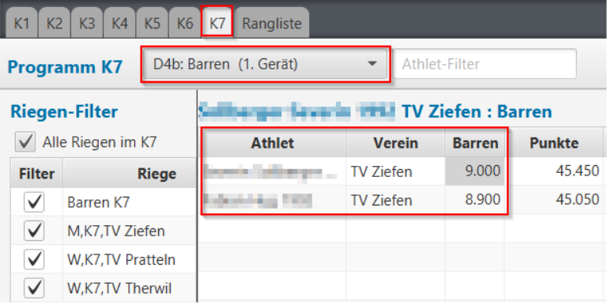
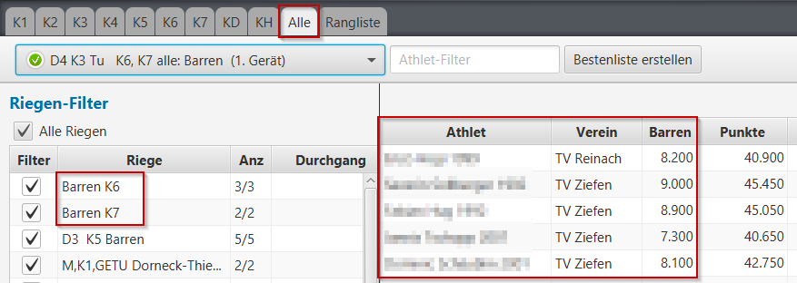
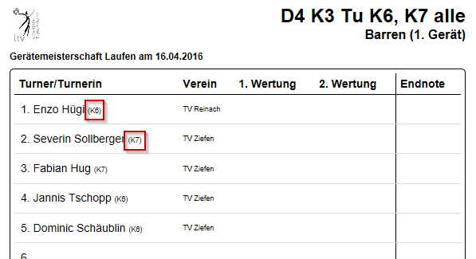

### Ausnahmen, Limitationen {#ausnahmen-limitationen}

#### Riegen mit gemischten Kategorien
<table>
  <tr>
    <td>
      Bei den Listen pro Kategorie/Programm kann es vorkommen, dass mit dem Riegenfilter <i>(hier K7)</i> nicht alle Turner-/Innen für die Erfassung zur Verfügung stehen <i>(hier fehlen die K6 Barrenturner)</i>.
    </td>
    <td>
      
    </td>
  <tr>
  <tr>
    <td>
      Wenn in einem Durchgang Kategorien/Programme gemischt werden, sollte für die Erfassung der Resultate die ungefilterte Liste der Turner <em>(Alle)</em> verwendet werden. 
    </td>
    <td>
      
    </td>
  <tr>
  <tr>
    <td>        
      Zur Orientierung, dass es sich bei einer Riege um eine "gemischte" Riege handelt, werden auf den Riegen-Notenblätter pro Turner/-In jeweils dessen Kategorie-/Programmeinteilung aufgedruckt.
    </td>
    <td>
        
    </td>
  <tr>
<table>

#### Durchgang, in dem nicht jedes Gerät eine Startriege hat
Wenn in einem Durchgang nicht alle benötigten Geräte mit einer Riege als Startgerät verknüpft werden (weil es z.B. nicht genügend Riegen gibt), 
dann kann die App nicht erkennen, welche Geräte ausser den als Startgerät verknüpften im Durchgang wirklich geturnt werden sollen.
Es macht also ein Turnus mit allen als Startgerät verknüpften Geräten (grün) und die restlichen (rot) werden ignoriert.

##### Lösung mit Notenblätter (Riegenblätter werden nicht verwendet)
In solchen Fällen wäre es besser, die Erfassung mit Notenblätter pro Turner durchzuführen, oder aber dass der Durchgang 
mit weiteren Kategorien zusammengefasst wird, so dass es für alle notwendigen Geräte auch eine Start-Riege geben kann.
 

##### Lösung mit leeren Riegen auf dem Startgerät
Eine andere Möglichkeit ist, im Durchgang beim Stargerät, wo keine Riege zugeteilt ist, eine leere Riege explizit zu setzen:
  

Die Riegenbezeichnung `Leere Riege [Durchgang/Gerät] (0)` wird automatisch generiert, so dass es keine Namenskonflikte geben sollte, wenn z.B. mehrere solche leeren Riegen eingefügt werden müssten:
 

Mit dieser leeren Riege im Startgerät des Durchganges wird sichergestellt, dass auch dieses Gerät in der Durchgangs-Rotation berücksichtigt ist.