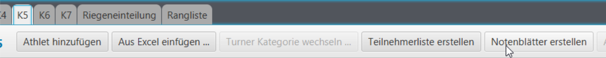
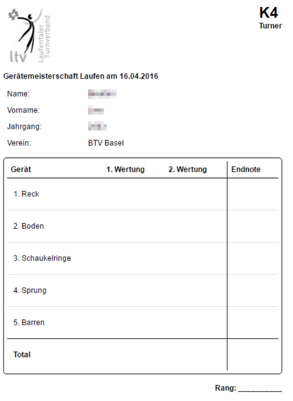
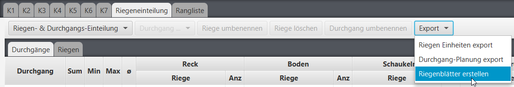
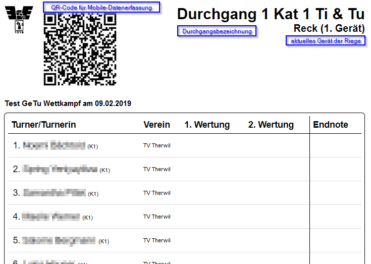

# Notenblätter / Riegennotenblätter erstellen

»Durchgänge mit gemischten Kategorien/Programmen / Durchgänge mit zu wenig Start-Riegen: Siehe [Ausnahmen und Limitationen]().

Für die Erstellung der Notenblätter wird die **pro Kategorie** wählbare Funktion "`Notenblätter erstellen`" benutzt:

Wenn nicht gleich für alle aus der Kategorie ein Notenblatt gedruckt werden soll, kann dies mit allen möglichen Filter eingeschränkt werden.

**Generiertes Notenblatt:**

Für die Generierung aller Riegennotenblätter muss auf den Tab "`Riegeneinteilung`" gewechselt werden. Vorausgesetzt wird eine fertige Riegeneinteilung, so dass die richtigen Turner zusammen auf die richtigen Blätter kommen.

Die Turner rotieren bei jedem Gerätewechsel \(jeweils der 1. wird hinten angestellt\).

**Generiertes Riegennotenblatt:**

