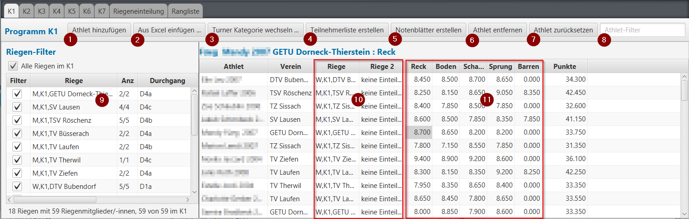

# Offline Wettkampf-Anmeldungen verarbeiten

1. Athlet/Innen aus der Datenbank auswählen, in den Wettkampf aufnehmen und in eine Kategorie einteilen.
2. Gruppen von angemeldeten Turner/Innen aus einem Excel-Sheet kopieren und im Wettkampf einfügen.
3. Bereits in eine Kategorie eingeteilte Turner in eine andere Kategorie umteilen.
4. Teilnehmerlisten erstellen.
5. Notenblätter erstellen.
6. Eine\(n\) im Wettkampf eingeteilte\(n\) Turner/In entfernen \(aus dem Wettkampf entfernen, nicht den/die Turner/In selbst löschen\).
7. Die erfassten Resultate zu einem/einer Turner/In zurücksetzen \(auf 0 zurückstellen\).
8. Einen Turner, eine Turnerin in der Liste suchen mit \(Bestandteilen aus Namen, Vornamen, Verein und Riege als Suchbegriffe\).
9. Statistik und Filter-Funktionen auf Riegen-Ebene, Riegen-Bezeichnungen bearbeiten und zu Durchgang und Startgerät verknüpfen.
10. Turner zu Riege Zuteilung bearbeiten, Riegennamen vergeben, umbenennen, zurücksetzen.
11. Resultate erfassen / kontrollieren.

