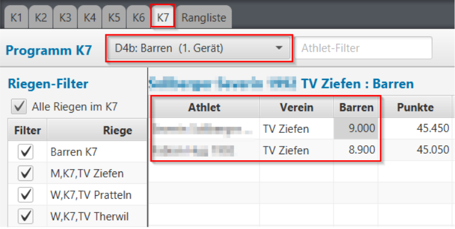

## Riegeneinteilung erstellen {#riegeneinteilung-erstellen}

Die Riegeneinteilung soll helfen, die Turner in möglichst homogenen und gleichmässig grossen Geräteriegen einzuteilen und diese auf Durchgänge zu verteilen. In der angezeigten Liste werden die Durchgänge mit den zugeteilten Riegen inklusive Statistikwerten über Summe, kleinste, grösste Riege und die Durchschnittsgrösse einer Riege angezeigt. Aus diesen Werten liesse sich auch in etwa errechnen, wie lange ein Durchgang dauern sollte (jeweils die grösste Geräteriege mal Anzahl gerätespezifische Durchlaufzeiten):

1.  `Riegen- & Durchgänge frisch einteilen`: Es werden pro Geschlecht, Kategorie und Verein jeweils eine Riege erstellt. Diese bildet die kleinste verschiebbare Einheit für die Zuweisung auf ein Startgerät in einem Durchgang. Die Funktion kennt momentan nur einen Parameter: Die maximale Gruppengrösse. Sie wird mit 11 vorbelegt und kann vom Benutzer individuell angepasst werden. Danach werden die Gruppen so verteilt, dass pro Durchgang möglichst gleichgrosse Geräteriegen existieren und dass Riegen von einem Verein möglichst zusammenbleiben (z.B. Turner und Turnerinnen). Danach können die Zuteilungen in der oberen Liste beliebig verändert werden.
2.  `Einteilung von Riegen & Durchgängen zurücksetzen`: Es werden alle Riegen- und Durchgangs- und Startgeräte-Einteilungen zurückgesetzt.

Wenn mindestens ein Durchgang (Multiselektion mittels `CTRL+linke Maustaste` oder `SHIFT+linke Maustaste` erweitern) in der Liste selektiert ist, können darauf diverse Überarbeitungsfunktionen angewendet werden:

1.  `Durchgang neu einteilen`: Die selektierten Durchgänge können mit angepassten Parameter neu eingeteilt werden. 
    Die nicht selektierten Durchgänge werden dabei nicht verändert. 
    Im Dialog werden die neuen Parameter angegeben. Neben der Gruppengrösse können hier zusätzlich folgende Einteilungsparameter eintestellt werden. Siehe [Details zu Durchgang neu einteilen](./durchgang-neu-einteilen.md)
2.  `Durchgänge zusammenlegen`: Wenn mindestens zwei Durchgänge selektiert sind, dann können diese mit dieser Funktion zusammengelegt werden. Die Turner-/Innen bleiben dabei bei ihrem eingeteilten Startgerät. Für den zusammengelegten Durchgang kann eine neue Bezeichnung gewählt werden.
3.  `Durchgang umbenennen`: Wenn genau ein Durchgang selektiert ist, dann kann diesem hiermit ein neuer Name vergeben werden. Sollte dabei ein bereits existierender Name vergeben werden, so kommt dies einer Durchgangs-Zusammenlegung gleich.
4.  `In anderen Durchgang verschieben`: Wenn genau ein Durchgang selektiert ist, dann können zugeteilte Riegen in andere Durchgänge verschoben werden. Es klappt ein Untermenü mit allen Riegennamen aus dem Durchgang auf. Die kleinste Riege ist zu oberst, die grösste zu unterst. Wird eine Riege ausgewählt kann im weiteren Untermenü der Ziel-Durchgang ausgewählt werden.
5.  `Auf anderes Startgerät verschieben`: Wenn genau ein Durchgang selektiert ist, dann können zugeteilte Riegen in eine andere Startgerät-Riege verschoben werden. Es klappt ein Untermenü mit allen Riegennamen aus dem Durchgang auf. Die kleinste Riege ist zu oberst, die grösste zu unterst. Wird eine Riege ausgewählt kann im weiteren Untermenü der Ziel-Startgeräteriege ausgewählt werden. Die Ziel-Startgeräteriegen sind mit ihrer aktuellen Grösse gekennzeichnet.

### Export-Funktionen

1.  `Riegen Einheiten export`: Das Resultat, welches die Riegen-Einteilenfunktion für sich zum Starten erstellt (die Riegen pro Geschlecht, Kategorie und Verein) kann in einer CSV-Datei zur weiteren Verarbeitung im Excel exportiert werden.
2.  `Durchgang-Planung export`: Mit dieser Funktion lässt sich die Durchgangsplanung in eine CSV-Datei exportieren. So lässt sich die Einteilung, die initial von der App gemacht wurde, ev. einfacher oder übersichtlicher im Excel nachbearbeiten.
3.  `Riegenblätter erstellen`: Mit dieser Funktion lassen sich alle Riegenblätter erstellen. Die Riegenblätter sind Notenblätter pro Geräte-Riege. Sie werden pro Gerät und Riege erstellt und beinhalten alle Turner-/Innen der Riege. Diese werden nach jedem Gerätewechsel von den Kampfrichtern eingesammelt, so dass die Resultate schon frühzeitig im Rechnungsbüro erfasst werden können.

### Mustervorgehen

* [Mustervorgehen für Athletiktest-Riegeneinteilung](/wettkampf-vorbereitung/riegeneinteilung_erstellen_mustervorgehen_att.md)
* [Mustervorgehen für KuTu-Riegeneinteilung](/wettkampf-vorbereitung/riegeneinteilung_erstellen_mustervorgehen_kutu.md)
* [Mustervorgehen für GeTu-Riegeneinteilung](/wettkampf-vorbereitung/riegeneinteilung_erstellen_mustervorgehen_getu.md)

### Ausnahmen, Limitationen {#ausnahmen-limitationen}

#### Riegen mit gemischten Kategorien

Wenn in einem Durchgang Kategorien/Programme gemischt werden, wird die Erfassung in der App dabei erschwert, 
weil in der App die Resultate strikt pro Kategorie/Programm erfasst werden müssen. Es kann also beim Erfassen der Resultate nicht einmal pro Riegen-Notenblatt der Filter mit den Turner/-Innen eingestellt und dann die Resultate von oben nach unten erfasst werden, weil die Turner/-Innen aus den anderen Kategorien/Programmen nicht angezeigt werden. Um die Erfassung dennoch zu erleichtern, wird zu diesem Zweck werden auf den Riegen-Notenblätter pro Turner/-In auch dessen Kategorie-/Programmeinteilung aufgedruckt. Dies soll dabei unterstützen, alle Resultate einer Kategorie/eines Programmes in einem Erfassungsdurchgang aus dem Riegen-Notenblatt heraussuchen zu können. Einteilung gemäss Durchgangs-Planung: Gemischte Riege mit K3, K6 und K7 Turnern am Barren.Gegenüber den Listen für die Resultaterfassung pro Kategorie/Programm:

#### Durchgang, in dem nicht jedes Gerät eine Startriege hat
Wenn in einem Durchgang nicht alle benötigten Geräte mit einer Riege als Startgerät verknüpft werden (weil es z.B. nicht genügend Riegen gibt), dann kann die App nicht erkennen, welche Geräte ausser den als Startgerät verknüpften im Durchgang wirklich geturnt werden sollen.Es macht also ein Turnus mit allen als Startgerät verknüpften Geräten (grün) und die restlichen (rot) werden ignoriert. In solchen Fällen wäre es besser, die Erfassung mit Notenblätter pro Turner durchzuführen, oder aber dass der Durchgang mit weiteren Kategorien zusammengefasst wird, so dass es für alle notwendigen Geräte auch eine Start-Riege geben kann.
 