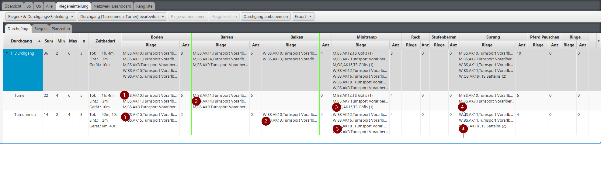
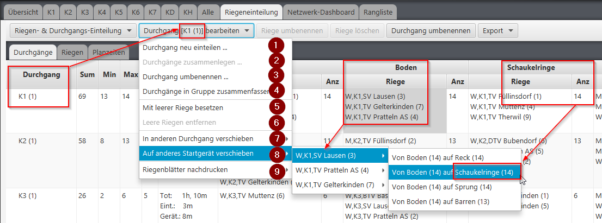
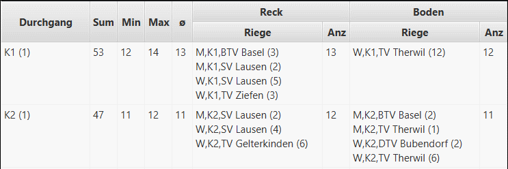
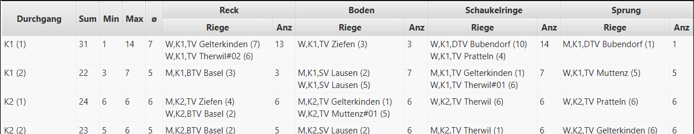
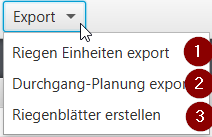

# Riegeneinteilung erstellen

Die Riegeneinteilung soll helfen, die Turner in möglichst homogenen und gleichmässig grossen Geräteriegen einzuteilen 
und diese auf Durchgänge zu verteilen. In der angezeigten Tabelle werden die Durchgänge mit den zugeteilten Riegen inklusive der Dauer- und Grössenangaben angezeigt.

Die Riegeneinteilung wird in der [Admin-Web-App](../webadmin.md) erstellt. In der [Wettkampf-Übersicht](../wettkampf_uebersicht.md) unter `Verwaltung` → `Riegeneinteilung`:

## Einteilung generieren

Mit dem Button `Generieren` wird die Einteilung automatisch erstellt. Zuvor lassen sich mit `Optionen` die Parameter festlegen:

* **Max. Riegengrösse**: Maximale Gruppengrösse. Mit `0` wird keine Aufteilung in mehrere Durchgänge vorgenommen (automatisch).
* **Max. Anzahl parallel geführter Durchgänge in einer Abteilung**: Mit `0` werden keine Durchgangs-Gruppen gebildet.
* **Geschlechter-Trennung**: `Automatisch`, `Gemischte Riegen`, `Gemischter Durchgang` oder `Getrennte Durchgänge`.
* **Nach Programm trennen**: Riegen werden zusätzlich nach Programm getrennt.
* **2. Riegen separat in Durchgänge**: Die zweiten Riegen eines Vereins werden separat in Durchgänge aufgeteilt.
* **Verteilung auf folgende Disziplinen**: Es kann festgelegt werden, auf welche Geräte die Riegen verteilt werden.

Es werden pro Geschlecht, Kategorie und Verein jeweils eine Riege erstellt. Diese bildet die kleinste verschiebbare Einheit für die Zuweisung auf ein Startgerät in einem Durchgang. Danach werden die Gruppen so verteilt, dass pro Durchgang möglichst gleichgrosse Geräteriegen existieren und dass Riegen von einem Verein möglichst zusammenbleiben (z.B. Turner und Turnerinnen).

Mit `Zurücksetzen` werden alle Riegen-, Durchgangs- und Startgeräte-Einteilungen zurückgesetzt.

## Riegen einteilen und nachbearbeiten

Noch nicht eingeteilte Riegen erscheinen oben in einer eigenen Liste. Eine Riege wird per **Drag & Drop** auf eine Zelle der Tabelle (Durchgang + Gerät) gezogen. Eingeteilte Riegen können ebenso per Drag & Drop auf ein anderes Startgerät oder in einen anderen Durchgang verschoben werden.

* **Leere Riege zuweisen**: Mit dem Plus-Button in einer Geräte-Zelle wird eine leere Riege hinzugefügt. Jedes Gerät, das im Wettkampf geturnt werden soll, muss entweder mit mindestens einer Startriege oder aber mit einer leeren Riege belegt werden.
* **Nur belegte Geräte anzeigen**: Blendet Geräte ohne Riegenbelegung aus.
* **Farblegende**: Zeigt an, welche Startgruppe die grösste und welche die kleinste ist.

### Durchgang bearbeiten

Durchgänge können mit der Checkbox in der ersten Spalte selektiert werden. Über die Auswahlleiste stehen folgende Funktionen zur Verfügung:

* **Neu generieren**: Die selektierten Durchgänge werden mit angepassten Parametern neu eingeteilt. Die nicht selektierten Durchgänge werden dabei nicht verändert.
* **Umbenennen**: Genau ein selektierter Durchgang erhält einen neuen Namen. Wird dabei ein bereits existierender Name vergeben, kommt dies einer Durchgangs-Zusammenlegung gleich.
* **Zusammenführen**: Zwei oder mehr selektierte Durchgänge werden zusammengelegt. Die Turner/-Innen bleiben dabei bei ihrem eingeteilten Startgerät.
* **Gruppe bilden**: Zwei oder mehr selektierte Durchgänge werden zu einer übergeordneten Durchgangs-Gruppe zusammengefasst. Siehe [Durchgang-Planung](durchgang-planung.md).
* **Gruppe wechseln**: Verschiebt selektierte Durchgänge in eine andere Durchgangs-Gruppe.
* **Gruppe auflösen**: Löst die Gruppierung der selektierten Durchgänge wieder auf.
* **Startzeit**: Setzt die Startzeit der selektierten Durchgänge bzw. Durchgangs-Gruppen.

## Geräte-Parallelisierung bei gemischten Durchgängen

Wenn in einem Durchgang an der selben Position im Geräte-Wechsel Ablauf die Turnerinnen ein anderes Gerät turnen wie die Turner, werden die Geräte-Positionen in der Reihenfolge zusammengefasst. Das bedeutet, dass nicht zuerst das Gerät der Turnerinnen auf dem Plan steht, und dann das Gerät der Turner.

**Ein Beispiel**

_Es gibt in diesem Durchgang nur 4 Gerätewechsel, obwohl ingesamt 5 Geräte geturnt werden. Dies, weil die Turnerinnen an zweiter Position Balken turnen, und die Turner an zweiter Position den Barren turnen._

## Drucken

Mit dem Druck-Button wird die aktuelle Riegeneinteilung im Browser gedruckt.

## Funktionen der Desktop-App

## Riegen einteilen und nachbearbeiten in der Desktop-App

1. `Riegen- & Durchgänge frisch einteilen`: Es werden pro Geschlecht, Kategorie und Verein jeweils eine Riege erstellt. Diese bildet die kleinste verschiebbare Einheit für die Zuweisung auf ein Startgerät in einem Durchgang. Die Funktion kennt momentan nur einen Parameter: Die maximale Gruppengrösse. Sie wird mit 11 vorbelegt und kann vom Benutzer individuell angepasst werden. Danach werden die Gruppen so verteilt, dass pro Durchgang möglichst gleichgrosse Geräteriegen existieren und dass Riegen von einem Verein möglichst zusammenbleiben (z.B. Turner und Turnerinnen). Danach können die Zuteilungen in der oberen Liste beliebig verändert werden.
2. `Einteilung von Riegen & Durchgängen zurücksetzen`: Es werden alle Riegen- und Durchgangs- und Startgeräte-Einteilungen zurückgesetzt.

Wenn mindestens ein Durchgang (Multiselektion mittels `CTRL+linke Maustaste` oder `SHIFT+linke Maustaste` erweitern) in der Liste selektiert ist, können darauf diverse Überarbeitungsfunktionen angewendet werden (resp. mit `rechte Maustaste` auf der Durchgangs-Zeile für Popup-Menu mit derselben Auswahl):

1.  `Durchgang neu einteilen`: Die selektierten Durchgänge können mit angepassten Parameter neu eingeteilt werden.

    

    Die nicht selektierten Durchgänge werden dabei nicht verändert.
    Wenn diese Funktion auf einer Disziplin-/Gerätespalte angewendet wird, wird die leere Riege nur dort hinzugefügt. Wenn diese Funktion vorne in der Durchgang-Spalte angewendet wird, werden überall dort leere Riegen hinzugefügt, wo noch keine Startriegeneinteilung existiert.
6.  `Leere Riegen entfernen`: Entfernt eine allenfalls vorhandene leere Riege.

    Wenn diese Funktion auf einer Disziplin-/Gerätespalte angewendet wird, wird die leere Riege nur dort entfernt. Wenn diese Funktion vorne in der Durchgang-Spalte angewendet wird, werden alle existierende leeren Riegen in dem selektierten Durchgang entfernt.
7. `In anderen Durchgang verschieben`: Wenn genau ein Durchgang selektiert ist, dann können zugeteilte Riegen in andere Durchgänge verschoben werden. Es klappt ein Untermenü mit allen Riegennamen aus dem Durchgang auf. Die kleinste Riege ist zu oberst, die grösste zu unterst. Wird eine Riege ausgewählt kann im weiteren Untermenü der Ziel-Durchgang ausgewählt werden.
8. `Auf anderes Startgerät verschieben`: Wenn genau ein Durchgang selektiert ist, dann können zugeteilte Riegen in eine andere Startgerät-Riege verschoben werden. Es klappt ein Untermenü mit allen Riegennamen aus dem Durchgang auf. Die kleinste Riege ist zu oberst, die grösste zu unterst. Wird eine Riege ausgewählt kann im weiteren Untermenü der Ziel-Startgeräteriege ausgewählt werden. Die Ziel-Startgeräteriegen sind mit ihrer aktuellen Grösse gekennzeichnet.
9. `Riegenblätter nachdrucken`: Im Wettkampf kann es durch späte Abmeldungen dazu führen, dass die Riegenblätter nachgedruckt werden müssen. Hierüber können beim selektierten Durchgang (auch Multiselektion möglich) die Riegenblätter neu ausgedruckt werden. Wahlweise nur vom 1. Gerät, oder von allen nachfolgenden Geräten, da die meisten Absenzen während dem 1. Gerät im Durchgang bemerkt werden. So können die Blätter für alle nachfolgenden Geräte nachgedruckt werden.

Folgende Funktionen der Riegeneinteilung stehen **nur in der Desktop-App** zur Verfügung:

* Kontext-Menü-Funktionen per rechter Maustaste auf der Durchgangs-Zeile (wie `Durchgang neu einteilen`, `Durchgänge zusammenlegen`, `Durchgang umbenennen`, `Durchgänge in Gruppe zusammenfassen`, `Mit leerer Riege besetzen`, `Leere Riegen entfernen`, `In anderen Durchgang verschieben`, `Auf anderes Startgerät verschieben`):

  

## Drag & Drop Unterstützung bei der Durchgang-Planung

Die Riegen können auch mittels Drag & Drop auf ein anderes Startgerät oder in einen anderen Durchgang verschoben werden:

`Riege auf anderes Startgerät verschieben`

`Riege in anderen Durchgang verschieben`

Mit gruppierten Durchgängen ist darauf zu achten, dass beim Fallenlassen (drop) der Riege die Durchgang-Gruppe aufgeklappt ist. Auf zugegklappte Durchgangs-Gruppen kann keine Riege zugeteilt werden. Siehe auch [Durchgang-Planung](durchgang-planung.md)

* **Export-Funktionen**:

  

  1. `Riegen Einheiten export`: Das Resultat, welches die Riegen-Einteilenfunktion für sich zum Starten erstellt (die Riegen pro Geschlecht, Kategorie und Verein) kann in einer CSV-Datei zur weiteren Verarbeitung im Excel exportiert werden.
  2. `Durchgang-Planung export`: Mit dieser Funktion lässt sich die Durchgangsplanung in eine Excel-Datei (.xlsx) exportieren. So lässt sich die Einteilung, die initial von der App gemacht wurde, einfacher oder übersichtlicher im Excel nachbearbeiten. Die Datei wird automatisch im Betriebssystem geöffnet.
  3. `Riegenblätter erstellen`: Mit dieser Funktion lassen sich alle Riegenblätter erstellen. Die Riegenblätter sind Notenblätter pro Geräte-Riege. Sie werden pro Gerät und Riege erstellt und beinhalten alle Turner/-Innen der Riege. Diese werden nach jedem Gerätewechsel von den Wertungsrichtern eingesammelt, so dass die Resultate schon frühzeitig im Rechnungsbüro erfasst werden können.

* **Riegenblätter nachdrucken**: Im Wettkampf kann es durch späte Abmeldungen dazu führen, dass die Riegenblätter nachgedruckt werden müssen. Wahlweise nur vom 1. Gerät, oder von allen nachfolgenden Geräten.

## Mustervorgehen

* [Mustervorgehen für Athletiktest-Riegeneinteilung](riegeneinteilung_erstellen_mustervorgehen_att.md)
* [Mustervorgehen für KuTu-Riegeneinteilung](riegeneinteilung_erstellen_mustervorgehen_kutu.md)
* [Mustervorgehen für GeTu-Riegeneinteilung](riegeneinteilung_erstellen_mustervorgehen_getu.md)
* [Mustervorgehen für Turn10®-Riegeneinteilung](riegeneinteilung_erstellen_mustervorgehen_turn10.md)
* [Mustervorgehen für TG Allgäu Pflicht & Kür -Riegeneinteilung](riegeneinteilung_erstellen_mustervorgehen_tgallgaeu.md)
