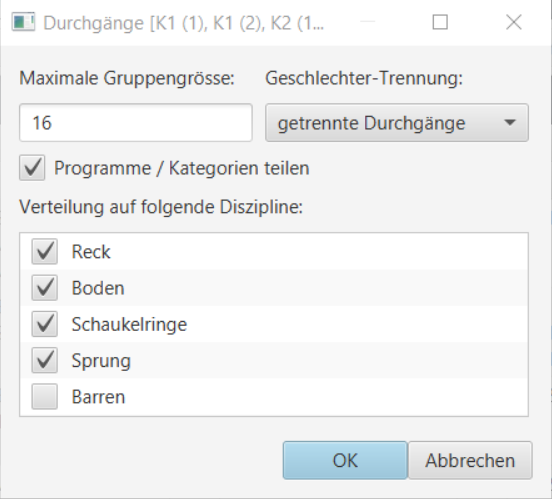

# Details zu Durchgang neu einteilen

|  |  |
| :--- | :--- |
| Die selektierten Durchgänge können mit angepassten Parameter neu eingeteilt werden. Die nicht selektierten Durchgänge werden dabei nicht verändert. Im Dialog werden die neuen Parameter angegeben. |  |

| Funktion | Beschreibung |
| :--- | :--- |
| Maximale Gruppengrösse | limitieren oder erweitern, was zu mehr oder weniger Durchgängen führen kann. |
| Geschlechter-Trennung | Bei `gemischte Geräterieten` werden geschlecht-gemischte Rigen erstellt. Bei `gemischter Durchgang` werden Riegen ohne Geschlechts-Durchmischung erstellt, innerhalb eines Durchganges werden jedoch Riegen beider Geschlechter eingeteilt. Bei `getrennte Durchgänge` werden Durchgänge ohne Geschlechts-Durchmischung erstellt. |
| Programme / Kategorien teilen | Wenn diese Option aktiviert ist, dann gibt es pro Programm/Kategorie eigene Durchgänge. Im deaktivierten Zustand können Programme/Kategorien in einem Durchgang gemischt werden. |
| Verteilung auf Diszipline | Einzelne `Geräte` im Durchgang `ausschliessen` oder mit `einschliessen`, was zu grösseren oder kleineren Gruppen führt und dadurch ev. mehr oder weniger Durchgängen. |

