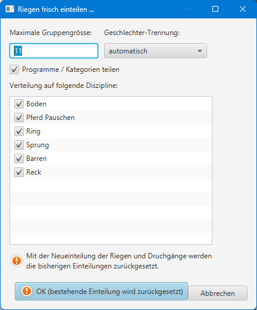
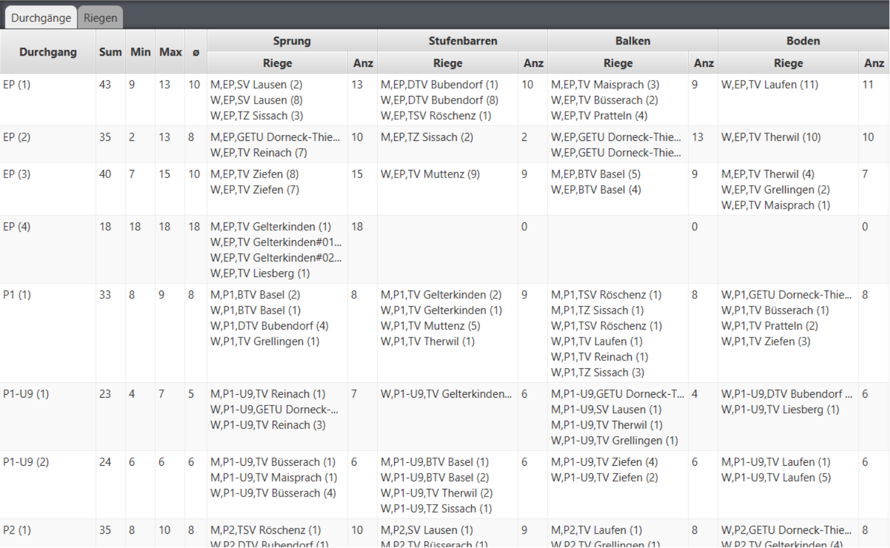
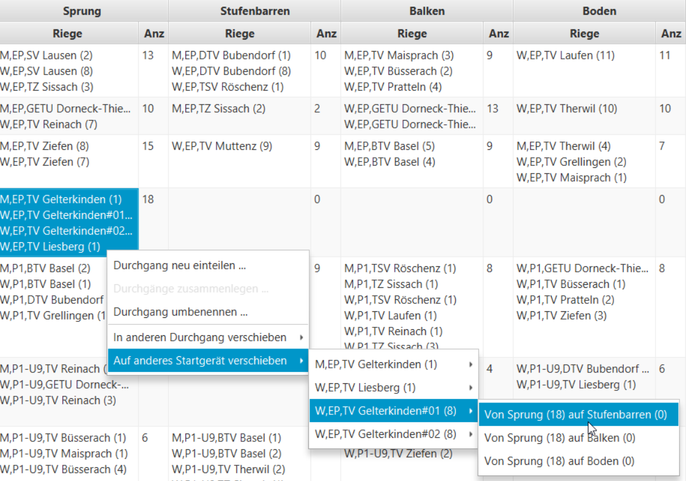

# Mustervorgehen für KuTu-Riegeneinteilung

Die initiale Riegenaufteilung wird mit dem Button `Riegen- & Durchgangs-Einteilung`->`Riegen & Durchgänge frisch einteilen` eingeleitet (1):

.png>)

Die KuTu oder KuTuri Riegenverteilung verteilt standardmässig mit einer Gruppengrösse von maximal 11 Turner/-Innen pro Startgerät:

Danach kann es pro Programm mehrere Durchgänge geben:

Diese können mit folgenden Kriterien einzeln oder mit Multiselection auf mehreren Durchgängen neu verteilt werden:

|                                                                                                            |                                                                                                                    |
| ---------------------------------------------------------------------------------------------------------- | ------------------------------------------------------------------------------------------------------------------ |
| .png>) | .png>) |

* `Maximale Gruppengrösse` limitieren, was zu mehr oder weniger Durchgängen führen kann.
* `Programme zusammenfassen` (indem sie nicht aufgeteilt werden).
* Einzelne `Geräte` im Durchgang `ausschliessen`, was zu grösseren Gruppen führt und dadurch ev. mehr Durchgängen.
* Die Aufteilung auf Geschlechts-Ebene macht in diesem Programm keinen Sinn, weil ein KuTuri-Wettkampf nur Turnerinnen kennt, und der KuTu-Wettkampf nur Turner (unterschiedliche Gerät-Zusammensetzung).

Zum Schluss können einzelne Einteilungen von Hand verschoben werden:

