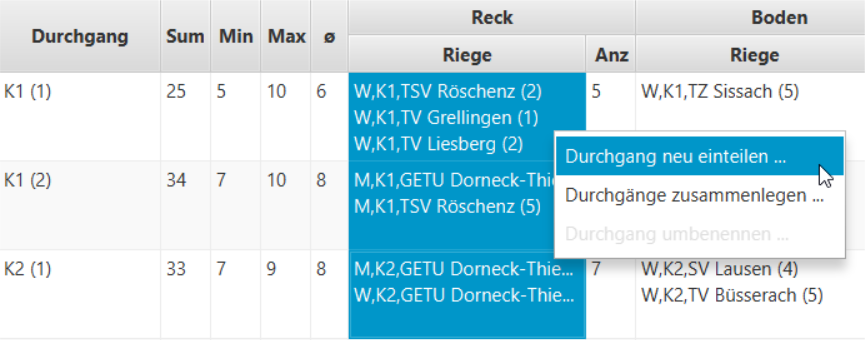
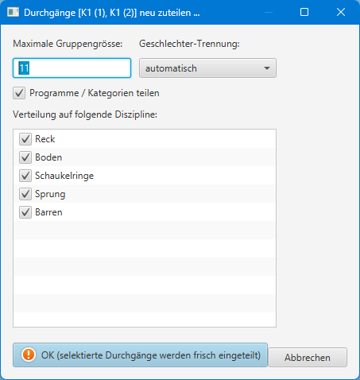

### Mustervorgehen für GeTu-Riegenverteilung {#mustervorgehen-f-r-getu-riegenverteilung}

Die initiale Riegenaufteilung wird mit dem Button `Riegen- & Durchgangs-Einteilung`->**`Riegen & Durchgänge frisch einteilen`** eingeleitet (1):

Die Getu Riegenverteilung verteilt standardmässig mit einer Gruppengrösse von maximal 11 Turner/-Innen pro Startgerät. Wenn als Maximale Gruppengrösse '0' eingetragen wird, dann wird automatisch die kleinstmögliche Gruppengrösse für ein Durchgang ermittelt und verwendet. 
Es werden alle Geräte ausser dem Barren für die Verteilung verwendet:

Danach kann es pro Kategorie mehrere Durchgänge geben:

Diese können einzeln oder mit Multiselection auf mehreren Durchgängen neu verteilt werden:

1|2
:-:|:-:
|

`Durchgang neu einteilen`: Die selektierten Durchgänge können mit angepassten Parameter neu eingeteilt werden. 
Die nicht selektierten Durchgänge werden dabei nicht verändert. 
Im Dialog werden die neuen Parameter angegeben. Neben der Gruppengrösse können hier zusätzlich folgende Einteilungsparameter eintestellt werden:

Funktion | Beschreibung 
---------:|:-------------
Maximale Gruppengrösse | limitieren oder erweitern, was zu mehr oder weniger Durchgängen führen kann.
Geschlechter-Trennung | Bei `gemischte Geräterieten` werden geschlecht-gemischte Rigen erstellt Bei `gemischter Durchgang` werden Riegen ohne Geschlechts-Durchmischung erstellt, innerhalb eines Durchganges werden jedoch Riegen beider Geschlechter eingeteilt Bei `getrennte Durchgänge` werden Durchgänge ohne Geschlechts-Durchmischung erstellt  Die Aufteilung auf Geschlechts-Ebene kann helfen, die Turner in einen separaten Durchgang zu ziehen, in welchem dann z.B. auch Barren verwendet wird: 
Programme / Kategorien teilen | Wenn diese Option aktiviert ist, dann gibt es pro Programm/Kategorie eigene Durchgänge. Im deaktivierten Zustand können Programme/Kategorien in einem Durchgang gemischt werden.
Verteilung auf Diszipline | Einzelne `Geräte` im Durchgang `ausschliessen` oder mit `einschliessen` (Barren), was zu grösseren oder kleineren Gruppen führt und dadurch ev. mehr oder weniger Durchgängen.

Zum Schluss können einzelne Einteilungen von Hand verschoben werden: 

Die Riegen können auch mittels Drag & Drop auf ein anderes Startgerät oder in einen anderen Durchgang verschoben werden:

`Riege auf anderes Startgerät verschieben`

`Riege in anderen Durchgang verschieben`

Mit gruppierten Durchgängen ist darauf zu achten, dass beim Fallenlassen (drop) der Riege die Durchgang-Gruppe aufgeklappt ist. Auf zugegklappte Durchgangs-Gruppen kann keine Riege zugeteilt werden.
Siehe auch [Durchgang-Planung](durchgang-planung.md)

Im GeTu ist es bei geschlechts-gemischten Durchgängen üblich, dass die Barren-Station am Ende eines Durchgangs für alle Turner aus dem Durchgang durchgeführt wird. Diese Einteilung lässt sich mit folgendem Trick erreichen:

Beschreibung | Illustration
-|-
Schritt 1: Markieren aller Turner-Riegen (alle mit einem M am Riegen-Namensanfang): | 
Danach den &quot;`2. Riege`&quot; -Button benutzen:|
und schliesslich die Barren-Riege benennen:|

In der Riegeneinteilung wird nun diese Barren K1 Riege mit aufgelistet. Jetzt muss nur noch der Durchgang ...

und das Startgerät (Barren) verknüpft werden:

Das Ergebnis davon lässt sich auch in der Durchgang-Ansicht anzeigen:

Mit der &quot;Riegenblätter-Erstellen&quot; Funktion werden somit auch Riegenblätter für das Barren-Gerät generiert - und bei der 
Resultaterfassung kann damit gefiltert werden.

Zum Schluss macht es Sinn, die Durchgänge für die Erkennung der chronologischen Zugehörigkeit so zu benennen, dass es auch für 
die Turner und Betreuer verständlich wird, wie diese Einteilung zu verstehen ist:

