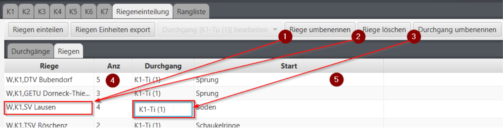

# Riegenzuteilung nachbearbeiten

Die Riegeneinteilung kann in dieser Ansicht individuell angepasst werden:

1. Wenn eine Riege in der oberen Liste selektiert ist, kann mittels dieser Funktion der Riegen-Name neu 

   vergeben / bearbeitet werden. Dies funktioniert auch direkt in der Liste.

2. Wenn eine Riege in der oberen Liste selektiert ist, kann diese mit dieser Funktion gelöscht werden. 

   Damit gehen die Riegen-Zuteilungen von den betroffenen Turner/Innen auch verloren. Diese Turner haben 

   dann bei der Riegen-Spalte "`Keine Einteilung`".

3. Wenn ein Durchgang in der oberen Liste selektiert ist, kann mittels dieser Funktion dessen Bezeichnung 

   bearbeitet werden. Dies funktioniert auch direkt in der Liste. Diese Funktion soll verwendet werden, 

   wenn die von der App generierten Durchgangsbezeichnungen in eine etwas sprechendere Form korrigiert 

   werden müssen \(z.B: von "`K1 (2)`" in "`2. Durchgang K1 Vormittag`".

4. In dieser Spalte wird die Grösse der Riege \(Anzahl Turner-/Innen\) angezeigt.
5. In dieser Spalte wird die Startgeräte-Zuteilung angezeigt. Die Zuteilung kann hier auch bearbeitet werden.

