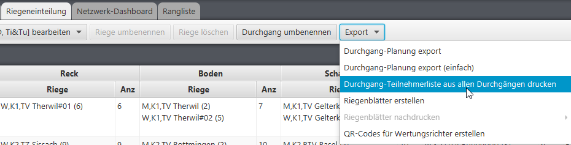
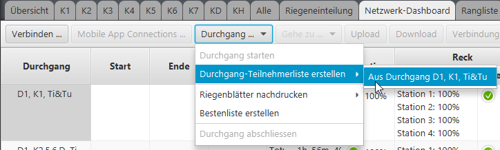

# Teilnehmerlisten erstellen

Für den Versand an die Vereine, oder für die Abwicklung vor Ort z.B. für Anwesenheitskontrolle, Abmeldungen etc. lassen sich die Teilnehmerlisten in verschiedenen Ausprägungen erstellen.

## Teilnehmerliste nach Kategorie

.png>)

Generierte Teilnehmerliste:

.png>)

## Teilnehmerliste nach Verein

Diese Liste wird nur online bereitgestellt und dient der Übersicht für die teilnehmenden. Der Link auf diese Liste wird in der Wettkampfübersicht bereitgestellt, kann aber erst verwendet werden, wenn der Wettkampf im Netz hochgeladen wurde und eine Einteilung gemacht wurde.

## Teilnehmerliste nach Durchgang

Diese Liste kann sowohl auf dem Riegeneinteilung-Tab als auch auf dem Netzwerk-Dashboard-Tab erstellt werden. Sie gruppiert die Teilnehmenden in den Durchgängen und listet alle Startgeräte auf. In dieser Gliederung ist sie geeignet, um am Wettkampf vor Ort die An-/Abmeldungen zu vermerken.

### Alle Durchgänge

Diese Funktion steht im Wettkampf-Modus nicht zur Verfügung.

### Selektierte Durchgänge aus Kontextmenu

Diese Funktion steht im Wettkampf-Modus nicht zur Verfügung.

### Selektierte Durchgänge aus Kontext-Button im Toolbar

Diese Funktion steht im Wettkampf-Modus nicht zur Verfügung.

### Selektierte Durchgänge aus Netzwerk-Dashboard Kontextmenu

Diese Funktion steht auch im Wettkampf-Modus zur Verfügung.

### Selektierte Durchgänge aus Netzwerk-Dashboard Kontext-Button im Toolbar

Diese Funktion steht auch im Wettkampf-Modus zur Verfügung.

