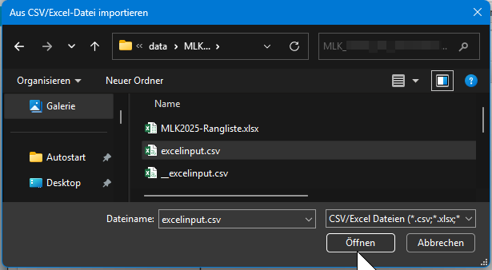
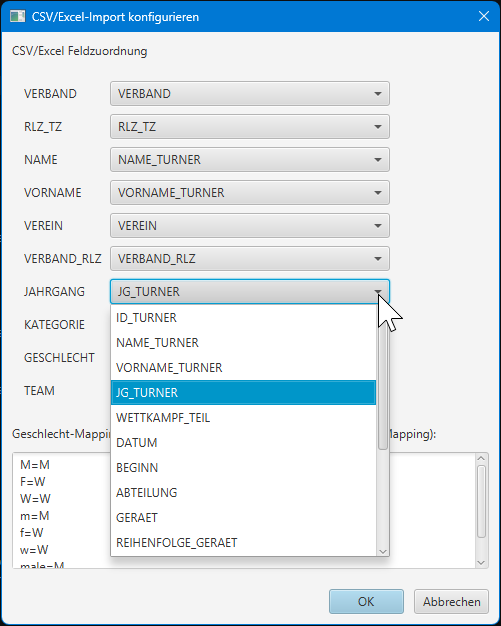
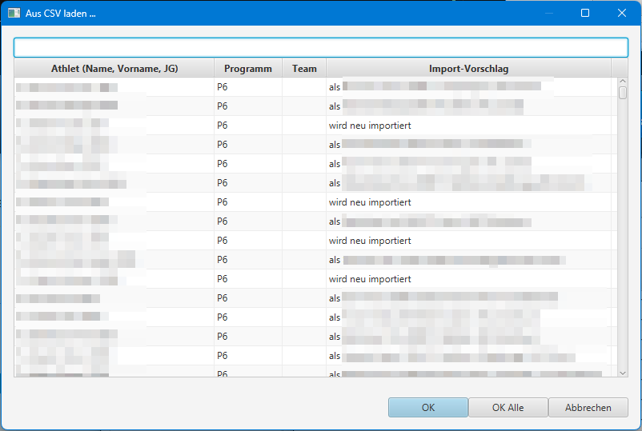
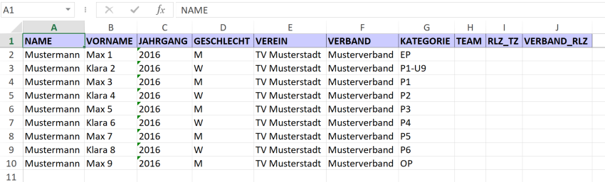
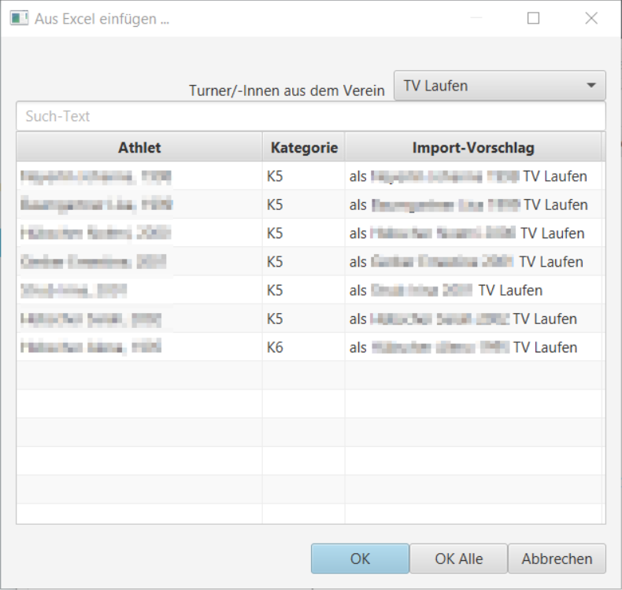
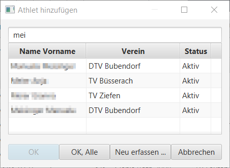

# Turneranmeldungen offline verarbeiten

Die Turneranmeldungen können mit Hilfe von CSV- oder Excelfiles importiert/exportiert werden.

                                                                         

## Import aus CSV oder Excel File (2)

Im Toolbar der Kategorien-Tabs gibt es ein Dropdown-Menu für Import- und Exportfunktionen.
Darin kann die Funktion Aus CSV/Excel importieren gewählt werden (2).

Diese Methode unterstützt das Einlesen kompletter Anmeldelisten inkl. aller benötigten Vereinsdaten und otionalen Team-Zurodnungen.
Fehlende Vereine oder Turner, Turnerinnen werden beim Import automatisch angelegt.

Beim aufrufen dieser Funktion kann zunächst die gewünschte Datei ausgewählt werden, die dann eingelesen wird.

### Feldmapping auf Datei anpassen

Es erscheint ein Dialog, in dem die notwendigen Spalten Mappings konfiguriert werden können. Es findet eine automatische Vorbelegung statt, sofern üblich Spaltenbezeichnungen verwendet werden.

### Importvorschlag

Bevor die Teilnehmer in den Wettkampf importiert werden, wird ein Dialog angezeigt, der den Abgleich als Vorschau anzeigt.
Beim Import aus CSV oder Excel File findet eine Synchronisierung statt. Das bedeutet, dass wenn im File eine Person ist, die im Wettkampf fehlt, wird
vorgeschlagen, dass sie in den Wettkampf aufgenommen wird.
Wenn eine Person im File fehlt, die im Wettkampf eingeteilt ist, wird vorgeschlagen, dass die Person aus dem Wettkampf entfernt wird.
Es gibt auch Umteilungsvorschläge, wenn zum Beispiel eine Anmeldung von einer Kategorie auf eine andere gewechselt hat, oder wenn die Teamzuordnung geändert hat.

### Definitiver Import

Aus dem Import-Vorschlag Dialog können dann alle oder einzelne Vorschläge übernommen werden.

## Excelvorlage für den Import der Anmeldungen erstellen (3)

Es kann eine Excel-Vorlage generiert werden, die den Vereinen für die Teilnehmer-Anmeldungen versendet werden kann. So ist die Struktur klar, wie das
Excel File aufgebaut werden muss. Es sint dort auch Muster-Einträg als Beispiele drin. Diese müssen nicht zwingend entfernt werden. Beim Import erkennt
die App die Mustereinträge und überliest diese.

## Abgleich der Anmeldedaten mit externen Tools - Export der Anmeldedaten (4)

Die Liste der Anmeldungen wird in ein Excel-File exportiert. Darüber lassen sich die Anmeldungsdaten mit anderen Tools austauschen.

## Copy Paste über die Zwischenablage aus einem Excel Sheet (1)

_Diese Option wird in künftigen App-Versionen entfernt werden._

Die in einem Excel-Sheet gespeicherten Turner/-Innen Daten können per Copy/Paste aus dem Excel übernommen werden und in dem gewünschten Wettkampf in der App eingefügt werden.

Dies funktioniert nur, wenn die Daten in exakt der erwarteten Spalten auszulesen sind (Name, Vorname, Jahrgang, Kategorie, Ti, Tu).

Hierbei müssen folgende Punkte beachtet werden:

|                                                                                                                                                                                                                                                                                                                                         |                                                                                                                                                                                                                                                                                                  |
| --------------------------------------------------------------------------------------------------------------------------------------------------------------------------------------------------------------------------------------------------------------------------------------------------------------------------------------- | ------------------------------------------------------------------------------------------------------------------------------------------------------------------------------------------------------------------------------------------------------------------------------------------------ |
| 1. Der Verein der Turneranmeldungen muss bereits in der App erfasst sein. Sollte dies nicht der Fall sein, muss der Verein zuerst erfasst werden (siehe [Verein anlegen](https://github.com/luechtdiode/turner-wettkampf-app-doku/tree/4c6a6466d07aa1a687e295023b6e4be4812c7928/stammdatenpflege/stammdatenpflege/verein\_anlegen.md)). | 2. Die Daten im Excel müssen zuvor manuell kontrolliert werden: `Namen` / `Vornamen` in der richtigen Spalte, `Geburtsdatum` im Format `TT.MM.JJJJ` erfasst, `Kategorie-Zuweisung` (reine Zahl oder mit dem K vorangestellt für z.B. KD oder KH) , `Geschlecht` mit `X` in der richtigen Spalte (`Ti`, `Tu`) gekennzeichnet?  |
| 3. Danach kann der ganze Block der Turner/-Innen Daten markiert und kopiert werden:                                                                                                                                                                                                                                                     |                                                                                                                                                                                                       |
| 4. Anschliessend können die Daten in der App auf dem gewünschten Wettkampf eingefügt werden (Button "`Aus Excel einfügen ...`" betätigen):                                                                                                                                                                                              |                                                                                                                                                                                                                          |
| 5. An diesem Punkt kann noch einmal verifiziert werden, ob alle Turner/-Innen richtig identifiziert wurden und ob der Verein richtig ausgewählt wurde. Der Verein wird nur dann automatisch ausgewählt, wenn mind. ein(e) Turner/In aus einem Verein bereits in der lokalen Datenbank erkannt wird und so die                           | Vereinszugehörigkeit implizit für alle gesetzt wird. Sollten nicht alle Turner der Liste aus dem gleichen Verein stammen, können einzelne Turner in der Liste angewählt werden und mit "`OK`" zum oben eingestellten Verein importiert werden. Die Kategorie-Zuteilung findet automatisch statt. |
| 6. Sollte kein Excel-Sheet mit Anmeldedaten vorhanden sein, kann mit der Funktion "`Athlet hinzufügen`" ein(e) Turner/In aus der Datenbank ausgewählt oder neu erfasst werden.                                                                                                                                                          |                                                                                                                                                                                                                                                          |
