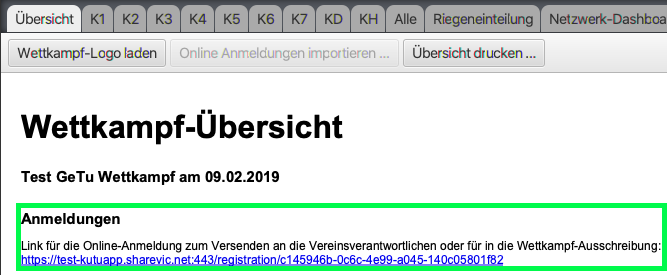
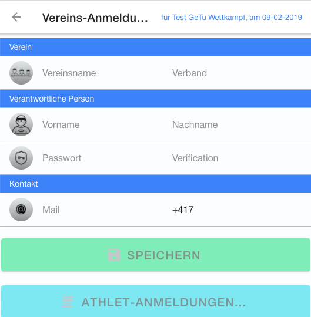
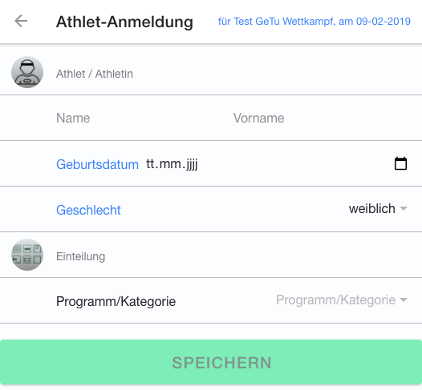
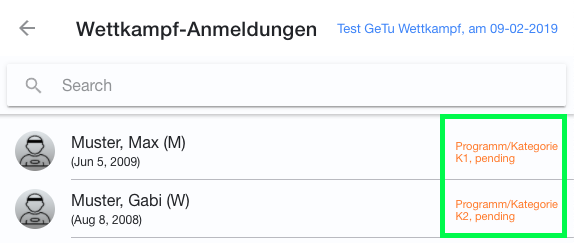
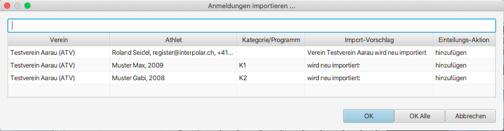
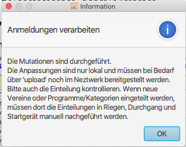
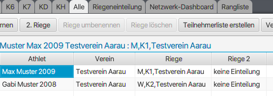
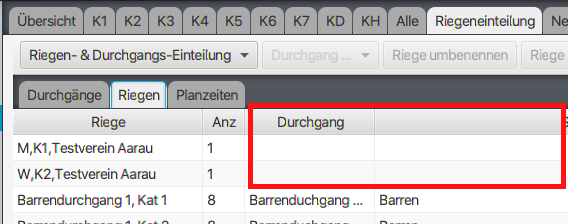

# Turneranmeldungen online verarbeiten

Sobald der angelegte Wettkampf im Netz bereit gestellt wurde, steht auf der Wettkampf-Übersicht der Link bereit, über welchen die Vereine die Anmeldungen tätigen können.

Es wird im folgenden zwischen dem Wettkampf lokal gespeichert und dem Wettkampf im Netz gespeichert unterschieden.

## Online-Anmeldungen, erfasst durch die Verantwortlichen der Vereine 

Jeder Verein, der sich an diesem Wettkampf anmelden möchte, muss sich über dieses Online-Formular registrieren, welches sich mit Hilfe des oben erwähnten Links öffnen lässt:

Anschliessend kann er sowohl seine Turnerinnen und Turner bei der entsprechenden Kategorie als auch die Wertungrichter/-Innen in einer separaten Liste anmelden:

Nach der Erfassung der Anmeldungen kann der Vereins-Verantwortliche in der Liste überwachen, ob seine Anmeldung in die Wettkampf-Einteilung übernommen wurde.

Solange das noch nicht der Fall ist, wird der Status `pending`angezeigt. Sobald die Anmeldung berücksichtigt wurde, wird der Status `in sync`angezeigt.

Auf der Maske der Vereinsanmeldung ist auch im Detail ersichtlich, welche Mutationen noch pendent sind.

## Abgleich der Online-Anmeldungen mit den Wettkampf-Einteilungen 

Für den Abgleich der Online-Anmeldedaten mit dem lokal gespeicherten Wettkampf muss die Verbindung mit dem Netzwerk aktiv sein \(siehe Grosser Button mit grüner Lampe\).

Mit der Funktion `Online Anmeldungen importieren` \(bei der Wettkampf-Übersicht\) können die Vereinsanmeldungen in den lokal gespeicherten Wettkampf importiert werden. Die Funktion prüft jedesmal, was sich bei den online erfassten Anmeldungen gegenüber dem lokal gespeicherten Wettkampf geändert hat und schlägt dann eine Liste von Mutationen vor, die am lokal gespeicherten Wettkampf durchgeführt werden können.

Wenn ein Verein nicht bereits in der lokalen Datenbank gespeichert ist, wird auch dessen übernahme notwendig, weil sonst dessen Anmeldungen nicht verarbeitet werden. Bereits bestehende Vereine werden erkannt und müssen nicht jedesmal neu importiert werden.

Folgende Mutations-Aktionen werden unterstützt:

| Aktion | Beschreibung |
| :--- | :--- |
| Verein importieren | Ein neuer Verein kann importiert werden. Um zu verhindern, dass sich Fake-Anmeldungen automatisch in der Datenbank einnisten, muss die initiale Übernahme vom Wettkampf-Administrator bestätigt werden. |
| Verein bestätigen | Eine neue Vereins-Wettkampfregistrierung eines bestehenden Vereins kann bestätigt werden. Um zu verhindern, dass sich Fake-Anmeldungen den Zugang zu bestehenden Vereinsdaten eines existierenden Vereins erschleichen, muss die eine Vereins-Registrierung zu einem Wettkampf vom Wettkampf-Administrator bestätigt werden. |
| Hinzufügen | Teilt den Athlet beim angegebenen Programm/Kategorie ein. Unter Import-Vorschlag wird angezeigt, ob der Athlet neu importiert wird, oder ob er in der Datenbank gefunden werden konnte und desshalb wiederverwendet werden kann. |
| Umteilen | Verschieb den Athlet von einem Programm/Kategorie in ein anderes Programm/Kategorie |
| Entfernen | Entfernt den angegebenen Athlet aus dem Wettkampf. Die Entfernen-Aktion entfernt nicht den Athlet beim Verein. |

Wenn die Mutationen erfolgreich durchgeführt werden konnten, wird dies mit folgender Meldung bestätigt:

Der neue Verein ist dann angelegt und dessen Turner und Turnerin im Wettkampf bei den entspr. Programmen/Kategorien eingeteilt. Der Riegenname wird automatisch generiert. Sofern bereits eine Durchgangsplanung gemacht wurde, **ist dort zu überprüfen, ob die Riege bereits eingeteilt ist**.

Siehe auch

* [Riegeneinteilung erstellen](../riegeneinteilung_erstellen/)
* [Riegenzuteilung nachbearbeiten](../riegenzuteilung_nachbearbeiten.md)

## Abschliessen der Anmeldungs-Verarbeitung

Nach der erfolgreichen Übernahme der Anmeldedaten \(dies kann auch wiederholt gemacht werden\), der Überprüfung der korrekten Einteilung und der Nachführung der Durchgangsplanung, **soll der Wettkampf wieder ins Netz aktualisiert werden**. Erst dann ist die Anpassung für alle sichtbar, also auch für die Vereine, die ihre Anmeldungen auf dem Online-Formular überprüfen.

## Mutationen der Online-Anmeldungen nach dem Import im Wettkampf

Auf dem Online-Formular für die Vereine ist ersichtlich, wenn sie nachträgliche Änderungen an ihrer Anmeldung tätigen, dass die Verarbeitung noch ausstehend ist. Wie oben beschrieben, kann das Import-Prozedere vom Wettkampf-Administrator wiederholt durchgeführt werden. Ihm werden beim Aufruf der `Online Anmeldungen importieren`-Funktion immer die neuesten Unterschiede angezeigt, so dass er diese nachführen lassen kann.

## Vereinfachungen bei wiederholten Anmeldungen

Wenn sich ein Verein im Verlauf der Zeit an mehreren Wettkämpfen anmeldet, dann stehen ihm nach der Registrierung am Wettkampf alle bisher erfassten Turner/-Innen dieses Vereins zur Auswahl, so dass er dessen Daten nicht jedesmal komplett neu erfassen muss.

Es ist unter dieser Bedingung auch möglich, dass eine komplette Anmeldung \(mit allen Turnerinnen und Turner, sowie den Wertungsrichter/-Innen\) von einem anderen Wettkampf kopiert werden kann, so dass danach nur noch wenig Anpassungen daran vorgenommen werden müssen.

### Spezifikation der Bedingung, wann bisherig erfasste Daten kopiert werden können

Aus Datenschutz-Gründen ist es nicht jedem neu registrierten Verein erlaubt, direkt auf den bereits vorliegenden Datenstamm der Vereinsturner/-Innen zuzugreifen. Der Schutz soll sicherstellen, dass nur dann Daten aus früheren Wettkämpfen kopiert werden können, wenn der neu registrierte Verein folgende Bedingungen erfüllt:

1. Der Verein hat bereits in einem bisherigen Wettkampf teilgenommen \(mit Turner/-Innen im Wettkampf eingeteilt\).
2. Der Wettkampf, an dem der Verein bereits teilgenommen hat, muss im Internet publiziert sein \(auf dem 

   Server hochgeladen\). Reine Offline durchgeführte Wettkämpfe können nicht berücksichtigt werden.

3. Der Verein muss in den folgenden Feldern identische Werte zu einer früheren Wettkampf-

   Anmeldung/Registrierung haben \(Gross-/Kleinschreibung wird beachtet\):

   * Vereinsname
   * Verband
   * EMail-Adresse des Vereins/Vereinsverantwortlichen
   * Passwort

