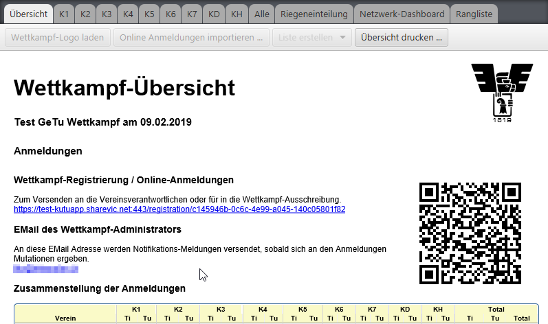
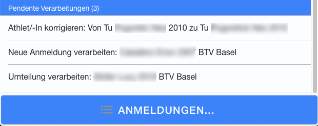

# Turneranmeldungen online verarbeiten

Sobald der angelegte Wettkampf im Netz bereit gestellt wurde, steht auf der Wettkampf-Übersicht der Link bereit, über welchen die Vereine die Anmeldungen tätigen können.

Es wird im folgenden zwischen dem Wettkampf lokal gespeichert und dem Wettkampf im Netz gespeichert unterschieden.

## Online-Anmeldungen, erfasst durch die Verantwortlichen der Vereine 

Jeder Verein, der sich an diesem Wettkampf anmelden möchte, muss sich über dieses Online-Formular registrieren, welches sich mit Hilfe des oben erwähnten Links öffnen lässt:

Es ist wichtig, dass der Vereins-Name exakt identisch erfasst wird, so wie er bisher in den vergangenen Wettkämpfen erfasst war.

Um dies sicherzustellen, kann der Vereinsname und Verband über das Suchfeld gesucht und im Formular vorbelegt werden.

Wenn ein neuer Vereinsname verwendet werden soll, ist die Vorbelegungsfunktion nicht relevant.

#### Mutationen an Vereinsname/Verband

Wenn nach der Registrierung der Vereinsname oder der Verband korrigiert werden, wird dem Wettkampf-Administrator die Mutation vorgelegt. Wenn diese angenommen wird, ist die Korrektur durchgägngig durchgeführt.

**Es ist zu bedenken, dass diese Funktion ausschliesslich als Korrektur-Funktion verstanden werden soll. Eine offizielle Vereins-Namensänderung resp. der Wechsel in einen anderen Verband sollte wie die Erfassung eines neuen Vereins abgewickelt werden.**

Anschliessend können sowohl die Turnerinnen und Turner bei der entsprechenden Kategorie als auch die Wertungrichter/-Innen in einer separaten Liste angemeldet werden:

Die möglichen Optionen sind:

1. Athlet & Athletinnen erfassen.
2. Wertungsrichter erfassen.
3. Daten aus einer frühereren Anmeldung kopieren. Diese Option ist nur verfügbar, wenn der Verein bereits einmal online Anmeldungen getätigt hat und die aktuelle Registrierung vom Wettkampf-Administrator bestätigt wurde.
4. Die Registrierung wird komplett gelöscht. Alle Daten zu den erfassten Athleten/-Innen und Wertungsrichter sind danach gelöscht.
5. Abbrechen - Das Anmeldungen-Menü wird zugeklappt.

#### Formular für die Anmeldung von Turner/-Innen

Das Erfassungsformular bietet eine Auswahl bisher erfasster Vereinsturner/-Innen aus früheren Wettkämpfen an. Neue Turner/-Innen können auch direkt im Formular erfasst werden. Wenn die Vereins-Registrierung am Wettkampf noch nicht vom Wettkampf-Administrator bestätigt wurde, steht diese Liste nicht zur Verfügung.

Bei der Ersterfassung findet eine strengere Validierung der Eingabedaten statt:

1. Das Geburtsdatum muss so sein, dass die erfasste Person aktuell zwischen 1 und 100 Jahren alt ist.
2. In Blockschrift erfasste Namen werden umgeformt, so dass der erste Buchstaben gross und der rest kein geschrieben ist.
3. Es werden (meist unbeabsichtigt) vorangestellte oder angehängte Leerzeichen im Namen und Vornamen entfernt.
4. Sofern der Vorname als Vorname aus einer Liste erkannt wird wird das Geschlecht überprüft, sofern das vom Vornamen her eindeutig ist. Bei fehlerhaftem Geschlecht wird dies automatisch korrigiert.
5. Sofern der Vorname im Namen-Feld erfasst wurde, und dieser als Vorname aus einer Liste erkannt wird, werden Name und Vorname umgetauscht.

Es kann sein, dass ein Vornamen verwendet wird (berechtigterweise), welcher aber nicht in der vorliegenden Vornamensliste existiert. In diesen Fällen kann es vorkommen, dass die App komisch reagiert. Nach der Ersterfassung kann eine ungewollte (falsch-) Korrektur wieder korrigiert werden.

Mutationen an den personen-bezogenen Daten sind möglich. Dies nach dem Grundsatz, dass Daten korrekt erfasst sein müssen. Wenn Mutationen an Personen-Daten gemacht werden, die noch nicht in der zentralen Datenbank übernommen wurden, ist das Speichern der Änderung ohne Warndialog möglich. Sobald es aber Daten sind, die z.B. über den Auswahl-Dialog übernommen wurden, oder die vom Wettkampf-Administrator bestätigt wurden, betreffen die Mutationen auch die bisher in der zentralen Datenbank gespeicherten Daten zu dieser Person. In diesem Fall wird folgender Warndialog angezeigt:

Die Mutation wird dem Wettkampf-Administrator vorgelegt. Dieser kann die Mutation übernehmen oder ablehnen. Im Fall der Ablehnung bleibt die Mutation ohne weiteren Hinweise im Status `pending`.

Nach der Erfassung der Anmeldungen kann der Vereins-Verantwortliche in der Liste überwachen, ob seine Anmeldung in die Wettkampf-Einteilung übernommen wurde.

Solange das noch nicht der Fall ist, wird der Status `pending` angezeigt. Sobald die Anmeldung berücksichtigt wurde, wird der Status `in sync` angezeigt. Dies gilt auch für spätere Mutationen.

Auf der Maske der Vereinsanmeldung ist auch im Detail ersichtlich, welche Mutationen noch pendent sind.

## Abgleich der Online-Anmeldungen mit den Wettkampf-Einteilungen 

### Abgleich der Online-Anmeldungen mit den Wettkampf-Einteilungen 

Für den Abgleich der Online-Anmeldedaten mit dem lokal gespeicherten Wettkampf muss die Verbindung mit dem Netzwerk aktiv sein (siehe Grosser Button mit grüner Lampe).

Mit der Funktion `Online Anmeldungen importieren` (bei der Wettkampf-Übersicht) können die Vereinsanmeldungen in den lokal gespeicherten Wettkampf importiert werden. Die Funktion prüft jedesmal, was sich bei den online erfassten Anmeldungen gegenüber dem lokal gespeicherten Wettkampf geändert hat und schlägt dann eine Liste von Mutationen vor, die am lokal gespeicherten Wettkampf durchgeführt werden können.

Wenn ein Verein nicht bereits in der lokalen Datenbank gespeichert ist, wird auch dessen übernahme notwendig, weil sonst dessen Anmeldungen nicht verarbeitet werden. Bereits bestehende Vereine werden erkannt und müssen nicht jedesmal neu importiert werden.

Folgende Mutations-Aktionen werden unterstützt:

| Aktion             | Beschreibung                                                                                                                                                                                                                                                                                                                      |
| ------------------ | --------------------------------------------------------------------------------------------------------------------------------------------------------------------------------------------------------------------------------------------------------------------------------------------------------------------------------- |
| Verein importieren | Ein neuer Verein kann importiert werden. Um zu verhindern, dass sich Fake-Anmeldungen automatisch in der Datenbank einnisten, muss die initiale Übernahme vom Wettkampf-Administrator bestätigt werden.                                                                                                                           |
| Verein bestätigen  | Eine neue Vereins-Wettkampfregistrierung eines bestehenden Vereins kann bestätigt werden. Um zu verhindern, dass sich Fake-Anmeldungen den Zugang zu bestehenden Vereinsdaten eines existierenden Vereins erschleichen, muss jede Vereins-Registrierung zu einem Wettkampf vom Wettkampf-Administrator bestätigt werden.          |
| Verein korrigieren | Name und Verband eines bestehenden Vereins werden korrigiert. **Diese Funktion korrigiert durchgängig, wirksam auch in allen bisherigen Wettkämpfen**                                                                                                                                                                             |
| Hinzufügen         | Teilt den Athlet beim angegebenen Programm/Kategorie ein. Unter Import-Vorschlag wird angezeigt, ob der Athlet neu importiert wird, oder ob er in der Datenbank gefunden werden konnte und desshalb wiederverwendet werden kann.                                                                                                  |
| Athlet korrigieren | Korrigiert die personen-bezogenen Daten eines Turners / einer Turnerin. **Diese Funktion korrigiert durchgängig, wirksam auch in allen bisherigen Wettkämpfen**. Bei Mutation des Geschlechts wird bei der betroffenen Person von M auf W die Barren-Riege zurückgesetzt, resp. von W auf M eine Barrenriege (Riege2) zugewiesen. |
| Umteilen           | Verschiebt den Athlet von einem Programm/Kategorie in ein anderes Programm/Kategorie                                                                                                                                                                                                                                              |
| Entfernen          | Entfernt den angegebenen Athlet aus dem Wettkampf. Die Entfernen-Aktion entfernt nicht den Athlet beim Verein.                                                                                                                                                                                                                    |

Die Verarbeitung wird sowohl lokal als auch auf dem Server durchgeführt. Der neue Verein ist dann angelegt und dessen Turner und Turnerin im Wettkampf bei den entspr. Programmen/Kategorien eingeteilt. Die Riegennamen werden automatisch generiert. Beim Geräteturn Wettkampf wird automatisch bei Athleten eine Riege2 mit `Barren <Kategorie>` generiert.

In diesem Fall ist es nicht notwendig, dass der Wettkampf manuell wieder mit `Upload` hochgeladen wird.

Es gibt eine Ausnahme, wo eine manuelle nachbearbeitung notwendig wird: Wenn nämlich bereits eine Riegeneinteilung vorhanden ist und es eine neue Riege gibt, die noch eingeteilt werden musss (Durchgang, Startgerät).

Sofern bereits eine Durchgangsplanung gemacht wurde, **ist dort zu überprüfen, ob die Riege bereits eingeteilt ist**.

Nach der manuellen Zuweisung in Durchgang und Startgerät muss der Wettkampf mit der `Upload` Funktion auf dem Netzwerk-Tab zum Server synchronisiert werden.

Siehe auch

* [Riegeneinteilung erstellen](../riegeneinteilung\_erstellen/)
* [Riegenzuteilung nachbearbeiten](../riegenzuteilung\_nachbearbeiten.md)

## Abschliessen der Anmeldungs-Verarbeitung

Nach der erfolgreichen Übernahme der Anmeldedaten (dies kann auch wiederholt gemacht werden), der Überprüfung der korrekten Einteilung und der Nachführung der Durchgangsplanung, **soll der Wettkampf wieder ins Netz aktualisiert werden**. Erst dann ist die Anpassung für alle sichtbar, also auch für die Vereine, die ihre Anmeldungen auf dem Online-Formular überprüfen.

## Mutationen der Online-Anmeldungen nach dem Import im Wettkampf

Auf dem Online-Formular für die Vereine ist ersichtlich, wenn sie nachträgliche Änderungen an ihrer Anmeldung tätigen, dass die Verarbeitung noch ausstehend ist. Wie oben beschrieben, kann das Import-Prozedere vom Wettkampf-Administrator wiederholt durchgeführt werden. Ihm werden beim Aufruf der `Online Anmeldungen importieren`-Funktion immer die neuesten Unterschiede angezeigt, so dass er diese nachführen lassen kann.

## Vereinfachungen bei wiederholten Anmeldungen

Wenn sich ein Verein im Verlauf der Zeit an mehreren Wettkämpfen anmeldet, dann stehen ihm nach der Registrierung am Wettkampf alle bisher erfassten Turner/-Innen dieses Vereins zur Auswahl, so dass er dessen Daten nicht jedesmal komplett neu erfassen muss.

Es ist unter dieser Bedingung auch möglich, dass eine komplette Anmeldung (mit allen Turnerinnen und Turner, sowie den Wertungsrichter/-Innen) von einem anderen Wettkampf kopiert werden kann, so dass danach nur noch wenig Anpassungen daran vorgenommen werden müssen.

### Spezifikation der Bedingung, wann bisherig erfasste Daten kopiert werden können

Aus Datenschutz-Gründen ist es nicht jedem neu registrierten Verein erlaubt, direkt auf den bereits vorliegenden Datenstamm der Vereinsturner/-Innen zuzugreifen. Der Schutz soll sicherstellen, dass nur dann Daten aus früheren Wettkämpfen kopiert werden können, wenn der neu registrierte Verein folgende Bedingungen erfüllt:

1. Der Verein hat bereits in einem bisherigen Wettkampf teilgenommen (mit Turner/-Innen im Wettkampf eingeteilt).
2.  Der Wettkampf, an dem der Verein bereits teilgenommen hat, muss im Internet publiziert sein (auf dem

    Server hochgeladen). Reine Offline durchgeführte Wettkämpfe können nicht berücksichtigt werden.
3.  Der Verein muss in den folgenden Feldern identische Werte zu einer früheren Wettkampf-

    Anmeldung/Registrierung haben (Gross-/Kleinschreibung wird beachtet):

    * Vereinsname
    * Verband
    * EMail-Adresse des Vereins/Vereinsverantwortlichen
    * Passwort
